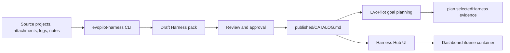

# EvoPilot Harness

> Independent Harness Factory, lifecycle CLI, Harness Hub, and published Catalog for EvoPilot-compatible domain templates.

Current release: `1.1.1` | Compatible EvoPilot: `>=3.0.0` | Runtime: Node.js `>=22`

[Documentation](docs/README.md) | [CLI](docs/cli/README.md) | [Harness Hub](docs/guides/harness-hub-integration.md) | [Catalog Contract](docs/reference/catalog-contract.md) | [Source Packs](harnesses/README.md) | [Published Catalog](published/CATALOG.md)

`evopilot-harness` owns Harness authoring, source-driven evolution, review, approval, versioning, publication, and the standalone Harness Hub UI. EvoPilot consumes the result by reading published Catalog directories at goal-plan time. EvoPilot does not import, publish, approve, or evolve Harness definitions.

## What You Can Do

| Capability | Command or Artifact |
|---|---|
| Publish a usable Harness Catalog | `node src/index.mjs catalog publish --source harnesses --out published --json` |
| Validate a Catalog before EvoPilot uses it | `node src/index.mjs catalog validate --source published --json` |
| Inspect and validate source Harness packs | `node src/index.mjs harness list --json` |
| Evolve a Harness from a project, attachment, log, or note | `node src/index.mjs evolve --source-project /path/to/project --goal "..." --json` |
| Review, approve, and publish generated drafts | `node src/index.mjs evolution review <id> --json` |
| Run the independent Harness Hub | `node src/index.mjs hub serve --catalog published --source harnesses` |
| Let EvoPilot read the published result | `EVOPILOT_HARNESS_CATALOG_DIRS=/path/to/evopilot-harness/published` |

## Quick Start

```bash
npm install
npm run check
npm run hub:serve
```

Open `http://127.0.0.1:4176` for the Harness Hub.

Use the one-command evolution path when a user should not need the atomic lifecycle:

```bash
node src/index.mjs evolve \
  --source-project /path/to/source-project \
  --goal "Create or evolve a distributed cache Harness from this project." \
  --approve-and-publish \
  --confirmed-by admin@example.com \
  --confirmation "Reviewed source coverage, draft diff, validation, and impact." \
  --json
```

Use atomic commands when an administrator needs review gates:

```bash
node src/index.mjs evolution create --source-project /path/to/project --goal "..." --json
node src/index.mjs evolution advance <evolution-id> --json
node src/index.mjs evolution review <evolution-id> --json
node src/index.mjs evolution approve <evolution-id> --confirmed-by <actor> --confirmation <text> --json
node src/index.mjs evolution publish <evolution-id> --json
```

## Architecture



The boundary is intentionally strict:

- `evopilot-harness` manages Harness lifecycle and owns `CATALOG.md`.
- EvoPilot dynamically reads configured published Catalog directories and records `selectedHarness` evidence.
- Dashboard can embed the Harness Hub, but it does not own Harness state.
- Harness definitions are EvoPilot-compatible contracts, not a universal control-plane format.

## Documentation

| Reader | Start Here |
|---|---|
| New users | [Documentation Index](docs/README.md), [CLI Quickstart](docs/cli/quickstart.md) |
| AI agents and CI | [CLI Agent Instructions](docs/cli/AGENTS.md), [Automation Rules](docs/cli/automation.md) |
| Harness administrators | [Harness Lifecycle](docs/guides/harness-evolution.md), [Source To Harness](docs/guides/source-to-harness.md) |
| EvoPilot integrators | [EvoPilot Integration](docs/guides/evopilot-integration.md), [Catalog Boundary](docs/architecture/catalog-consumption-boundary.md) |
| Dashboard integrators | [Harness Hub Integration](docs/guides/harness-hub-integration.md) |
| Release operators | [Release Management](docs/operations/release-management.md), [Deployment](docs/operations/deployment.md) |
| Schema reviewers | [Catalog Contract](docs/reference/catalog-contract.md), [Template Schema](docs/reference/template-schema.md) |

## Development

```bash
npm run catalog:publish
npm run catalog:validate
npm run hub:snapshot
npm run docs:links
npm test
npm run check
```

Release artifacts are built from a clean checkout:

```bash
npm run release:artifact
npm run verify:release-artifact
```

## Repository Layout

```text
harnesses/             Source Harness packs maintained by this project
published/             Usable Catalog directory read by EvoPilot
src/index.mjs          CLI, Catalog publisher, evolution engine, and Hub server
ui/harness-hub/        Standalone browser UI
docs/                  Human, AI-agent, architecture, operation, and reference docs
scripts/               Release and documentation verification helpers
tests/                 CLI and Catalog behavior tests
```

## License

`evopilot-harness` is declared as `Apache-2.0` in `package.json`.
