# EvoPilot Harness

> A user-owned Harness asset factory for turning model-external execution environments, actions, constraints, evidence, and validators into reusable production assets.

Current version: `3.0.0` | Runtime: Node.js `>=22` | License: Apache-2.0

[Documentation](docs/README.md) | [Quickstart](docs/cli/quickstart.md) | [Asset Model](docs/architecture/v3-asset-model.md) | [Reasoning Contract](docs/reference/v3-reasoning-contract.md) | [Harness Hub](docs/guides/harness-hub-integration.md) | [v3 Release](docs/releases/3.0.0.md)

`evopilot-harness` is an independent Harness producer. It owns source ingestion, Evidence Graphs, eligibility and matching, GLM Advisor review, asset drafting, human approval, signing, evaluation, and Catalog publication. It does not onboard third-party projects into EvoPilot and does not run EvoPilot goal loops.

## Asset Model

| Asset | Purpose |
|---|---|
| `HarnessComponent` | Atomic reusable execution capability with environment, actions, constraints, evidence, and validators. |
| `HarnessProfile` | Domain, role, and repeatable-task composition built from Components. |
| `HarnessBundle` | Immutable resolved executable publication with pinned Component digests. |
| `OntologyPack` | Versioned concepts and role relationships used by the matcher. |
| `MatchPolicyPack` | Versioned eligibility, BM25 retrieval, scoring, thresholds, and risk rules. |
| `AdvisorPolicyPack` | Evidence-bound GLM prompt, output contract, and authority limits. |
| `EvaluationPack` | Reviewed regression cases and explicit evidence-sufficiency status. |

A Harness is not a broad software category description. It is a versioned executable asset package for one class of repeatable engineering task.

## Quick Start

```bash
npm install

export EVOPILOT_HARNESS_HOME="$HOME/.evopilot-harness"
node src/index.mjs workspace init --workspace "$EVOPILOT_HARNESS_HOME" --json
node src/index.mjs asset v3-test --workspace "$EVOPILOT_HARNESS_HOME" --json
node src/index.mjs hub v3-serve --workspace "$EVOPILOT_HARNESS_HOME"
```

Open `http://127.0.0.1:4176` for the standalone Harness Hub.

Produce a proposal from one local project:

```bash
node src/index.mjs produce \
  --workspace "$EVOPILOT_HARNESS_HOME" \
  --source-project /path/to/project \
  --goal "Produce or evolve a reusable Harness asset for this engineering task." \
  --json
```

Produce grouped proposals from all valid projects under a root:

```bash
node src/index.mjs produce \
  --workspace "$EVOPILOT_HARNESS_HOME" \
  --source-root /path/to/project-root \
  --goal "Produce reusable Harness assets from this project corpus." \
  --json
```

Supported evidence sources are local projects, project roots, GitHub repositories, PDF/PPTX/DOCX/text attachments, production logs, historical Harness files, and operator notes. Controlled internet research requires both `--research-url` and `--allow-internet-research`; it is supplemental evidence and cannot override local source or log facts.

## Decision Contract

The v3 matcher emits one of these decisions:

- `EVOLVE_EXISTING`
- `COMPOSE_NEW_BUNDLE`
- `PROPOSE_NEW_PROFILE`
- `INSUFFICIENT_EVIDENCE`
- `NOT_HARNESS_ELIGIBLE`
- `REVIEW_REQUIRED`

Unknown domains become reviewed Profile Proposals. They are not silently converted into published Harnesses. Ambiguous and new-Profile decisions require GLM Advisor review plus human approval. The model may recommend; it cannot approve, publish, execute arbitrary code, mutate `models.json`, or override deterministic gates.

## Review And Publish

Every `produce` run stops at review. Inspect `reasoning`, candidate factor scores, `evidenceIds`, Advisor citations, proposed asset diff, schema validation, blockers, and evaluation status.

```bash
node src/index.mjs proposal review <proposal-id> \
  --workspace "$EVOPILOT_HARNESS_HOME" \
  --json

node src/index.mjs proposal approve <proposal-id> \
  --workspace "$EVOPILOT_HARNESS_HOME" \
  --confirmed-by admin@example.com \
  --confirmation "Reviewed evidence, reasoning, Advisor citations, asset boundary, and evaluation case." \
  --evaluation-reviewed \
  --json

node src/index.mjs proposal publish <proposal-id> \
  --workspace "$EVOPILOT_HARNESS_HOME" \
  --json
```

Configure GLM manually in a CodeBuddy-style `models.json`. The application reads this file but never writes it. Only a Zhipu GLM profile is eligible in v3.

```bash
node src/index.mjs llm v3-models \
  --workspace "$EVOPILOT_HARNESS_HOME" \
  --models-file /path/to/models.json \
  --json
```

## Architecture

```mermaid
flowchart LR
  Sources["Projects, GitHub, attachments, logs, notes"] --> Snapshot["Redacted Evidence Graph"]
  Snapshot --> Gate["Harness Eligibility Gate"]
  Gate --> Matcher["Ontology + BM25 + multi-factor matcher"]
  Matcher --> Advisor["Policy-required GLM Advisor"]
  Advisor --> Proposal["Profile or Bundle Proposal"]
  Proposal --> Review["Human review and evaluation"]
  Review --> Assets["Component / Profile / Bundle"]
  Assets --> Catalog["Signed CATALOG.md"]
  Catalog --> Registry["Registry lists Catalog roots"]
```



The Engine installation is treated as read-only. Mutable user assets, evidence, policies, runs, evaluations, keys, and Catalogs live under `EVOPILOT_HARNESS_HOME`. Engine release `3.0.0` and user asset versions are independent.

The canonical v3 asset is product-neutral. A Bundle may contain an optional `exports/evopilot/template.yaml` projection, but the canonical asset is not defined by EvoPilot's legacy template format.

## Compatibility

The v2 commands remain available as a compatibility layer for existing automation. Use `migrate v2-to-v3` for a non-mutating dry run or `--apply` to create v3 Profiles, Bundles, and optional EvoPilot exports in the writable Workspace. Migration journals support rollback.

```bash
node src/index.mjs migrate v2-to-v3 \
  --workspace "$EVOPILOT_HARNESS_HOME" \
  --source harnesses \
  --json
```

## Validation

```bash
npm test
npm run v3:check
npm run check
```

`eval v3-run` validates contracts and safety regressions. Unless enough reviewed cases exist, it reports `INSUFFICIENT_EVAL_EVIDENCE`; passing fixtures is not presented as open-domain matching accuracy.

## Repository Layout

```text
assets/v3/          Built-in Component, Profile, Bundle, and export assets
ontology/           Versioned Ontology Packs
policies/           Versioned Matcher and Advisor Policy Packs
schemas/            Formal JSON Schemas
src/v3/             Workspace, reasoning, Advisor, lifecycle, Catalog, and Hub modules
harnesses/          Legacy v2 source packs retained for compatibility and migration
ui/harness-hub/     Standalone Harness Hub
docs/               Human and AI-agent documentation
eval/               Contract, safety, and replay fixtures
tests/              v2 compatibility and v3 end-to-end tests
```
