# EvoPilot Harness

> Independent Harness Factory, lifecycle CLI, Harness Hub, and published Catalog for EvoPilot-compatible domain templates.

Current release: `2.1.0` | Compatible EvoPilot: `>=3.0.0` | Runtime: Node.js `>=22`

[Documentation](docs/README.md) | [CLI](docs/cli/README.md) | [Harness Hub](docs/guides/harness-hub-integration.md) | [Registry Contract](docs/reference/registry-contract.md) | [Catalog Contract](docs/reference/catalog-contract.md) | [Source Packs](harnesses/README.md) | [Published Catalog](published/CATALOG.md)

`evopilot-harness` owns Harness authoring, source-driven evolution, review, approval, versioning, publication, and the standalone Harness Hub UI. EvoPilot consumes the result by reading `harness-registry.yaml` and the published Catalog directories it points to at goal-plan time. EvoPilot does not import, publish, approve, or evolve Harness definitions.

## What You Can Do

| Capability | Command or Artifact |
|---|---|
| Publish a usable Harness Catalog | `node src/index.mjs catalog publish --source harnesses --out published --json` |
| Validate a Catalog before EvoPilot uses it | `node src/index.mjs catalog validate --source published --json` |
| Publish a multi-Catalog Registry | `node src/index.mjs registry publish --catalog published --registry harness-registry.yaml --json` |
| Validate Registry and enabled Catalog roots | `node src/index.mjs registry validate --registry harness-registry.yaml --json` |
| Inspect and validate source Harness packs | `node src/index.mjs harness validate --strict --json` |
| Inspect and validate Harness Asset v2 envelopes | `node src/index.mjs asset validate --source harnesses --json` |
| Detect the best Harness target before evolution | `node src/index.mjs detect --source-project /path/to/project --goal "..." --json` |
| Detect from a GitHub repository source | `node src/index.mjs detect --github-repo owner/repo --github-ref main --goal "..." --json` |
| Batch-detect projects under a source root | `node src/index.mjs detect batch --source-root /path/to/root --include-modules --json` |
| Plan grouped Harness evolution from a project corpus | `node src/index.mjs corpus plan --source-root /path/to/root --include-modules --json` |
| Evolve a Harness from a project, attachment, log, or note | `node src/index.mjs evolve --source-project /path/to/project --goal "..." --json` |
| Evolve a Harness from a GitHub repository | `node src/index.mjs evolve --github-repo https://github.com/owner/repo --github-ref main --goal "..." --json` |
| One-command corpus evolution with review gates | `node src/index.mjs evolve corpus --source-root /path/to/root --include-modules --json` |
| Inspect local EvoPilot GLM config | `node src/index.mjs llm models --llm-models-file models.json --json` |
| Add semantic LLM Advisor review | `EVOPILOT_HARNESS_LLM_ADVISOR=optional node src/index.mjs evolve --source-project /path/to/project --goal "..." --json` |
| Replay expected LLM Advisor decisions | `node src/index.mjs llm replay --json` |
| Run unknown-source matching evals | `node src/index.mjs eval run --json` |
| Review, approve, and publish generated drafts | `node src/index.mjs evolution review <id> --json` |
| Run the independent Harness Hub | `node src/index.mjs hub serve --catalog published --source harnesses` |
| Let EvoPilot read published Harnesses | `EVOPILOT_HARNESS_REGISTRY_CONFIG=/path/to/evopilot-harness/harness-registry.yaml` |

## Quick Start

```bash
npm install
npm run check
npm run hub:serve
```

Open `http://127.0.0.1:4176` for the Harness Hub.

Use the one-command evolution path when a user should not need the atomic lifecycle:

```bash
node src/index.mjs detect \
  --source-project /path/to/source-project \
  --goal "Create or evolve a reusable domain Harness from this project." \
  --json
```

Review `sourceProfile.primaryRole`, `autoMatch.decision`, `autoMatch.targetHarnessId`, `autoMatch.parentCandidates`, and `nextAction` before deciding whether to run `evolve`.

```bash
node src/index.mjs evolve \
  --source-project /path/to/source-project \
  --goal "Create or evolve a distributed cache Harness from this project." \
  --llm-advisor optional \
  --approve-and-publish \
  --confirmed-by admin@example.com \
  --confirmation "Reviewed source coverage, draft diff, validation, and impact." \
  --json
```

For a public GitHub project, use `--github-repo`. The CLI clones or fetches the repository into `.evopilot-harness/github-sources/`, scans that local checkout, and records the upstream repository, ref, resolved commit, and cache path in source coverage. Do not pass raw GitHub tokens in the URL; use local Git credentials or SSH for repositories that require authentication.

```bash
node src/index.mjs detect \
  --github-repo owner/repo \
  --github-ref main \
  --goal "Create or evolve a reusable domain Harness from this GitHub repository." \
  --json

node src/index.mjs evolve \
  --github-repo https://github.com/owner/repo \
  --github-ref main \
  --goal "Create or evolve a reusable domain Harness from this GitHub repository." \
  --json
```

Generated drafts optimize for more accurate, professional, and fine-grained Harness definitions: stronger product boundaries, more specific match policies, concrete evidence contracts, finer domain execution actions, and reviewable negative signals. Large-scale performance optimization, throughput expansion, and runtime tuning are non-goals unless an operator explicitly supplies evidence and asks for them.

For production semantic review, configure `models.json` manually with the same GLM used by EvoPilot. The file format intentionally matches CodeBuddy-style `models.json`, but the content should contain only EvoPilot GLM:

```json
{
  "models": [
    {
      "id": "glm-5.1",
      "name": "EvoPilot GLM",
      "vendor": "zhipu",
      "apiKey": "<manual-local-api-key>",
      "url": "https://open.bigmodel.cn/api/coding/paas/v4",
      "supportsToolCall": true,
      "supportsReasoning": true
    }
  ]
}
```

`models.json` is ignored by Git. `evopilot-harness` reads it but never writes, edits, imports, or publishes it. By default the CLI selects a GLM profile from that file. If no file exists, it falls back to the built-in `evopilot-glm` profile metadata and requires `EVOPILOT_HARNESS_LLM_API_KEY` or `EVOPILOT_LLM_API_KEY` to actually call the model.

```bash
node src/index.mjs llm models --json

node src/index.mjs evolve \
  --source-project /path/to/source-project \
  --goal "Create or evolve a reusable domain Harness from this project." \
  --llm-advisor required \
  --json
```

`llmAdvisor` is optional by default. It records source classification, target recommendation, alternatives, warnings, profile/provider/model, and token usage when a configured model is available, but it does not approve or publish. Use `--llm-advisor required` when a model call must succeed, `--no-llm-advisor` for deterministic-only runs, and `--apply-llm-advisor` only when a high-confidence Advisor recommendation is allowed to change the generated draft target.

Validate template quality before publishing a release baseline:

```bash
node src/index.mjs harness validate --source harnesses --strict --json
node src/index.mjs catalog publish --source harnesses --out published --strict --json
```

Use atomic commands when an administrator needs review gates:

```bash
node src/index.mjs evolution create --source-project /path/to/project --goal "..." --json
node src/index.mjs evolution advance <evolution-id> --json
node src/index.mjs evolution review <evolution-id> --json
node src/index.mjs evolution approve <evolution-id> --confirmed-by <actor> --confirmation <text> --json
node src/index.mjs evolution publish <evolution-id> --json
```

For a root directory that contains many historical projects, use the corpus lifecycle. It scans all valid project roots, auto-matches them, groups by target Harness, dedupes nested modules, generates one draft per group, and stops at review:

```bash
node src/index.mjs corpus scan \
  --source-root /path/to/project-root \
  --include-modules \
  --json

node src/index.mjs corpus plan \
  --source-root /path/to/project-root \
  --include-modules \
  --max-projects-per-group 5 \
  --json
```

After review:

```bash
node src/index.mjs corpus approve <corpus-id> \
  --confirmed-by admin@example.com \
  --confirmation "Reviewed corpus grouping, dedupe decisions, generated drafts, validation, and publication impact." \
  --json

node src/index.mjs corpus publish <corpus-id> --json
```

## Architecture

```mermaid
flowchart LR
  Source["Source projects, attachments, logs, notes"] --> Detect["Unknown Source Decision Aggregator v2"]
  Detect --> Factory["evopilot-harness CLI"]
  Factory --> Draft["Draft Harness pack"]
  Draft --> Quality["Template Quality Standard v1"]
  Quality --> Review["Review and approval"]
  Review --> Asset["Harness Asset v2 envelope"]
  Asset --> Catalog["published/CATALOG.md"]
  Catalog --> Registry["harness-registry.yaml"]
  Registry --> EvoPilot["EvoPilot goal planning"]
  Catalog --> Hub["Harness Hub UI"]
  Hub --> Dashboard["Dashboard iframe container"]
  EvoPilot --> Selected["plan.selectedHarness evidence"]
```



The boundary is intentionally strict:

- `evopilot-harness` manages Harness lifecycle, owns `CATALOG.md`, and publishes `harness-registry.yaml`.
- `harness-registry.yaml` only lists enabled Catalog roots, priority, release, and optional expected digest. It does not duplicate Harness entries.
- EvoPilot dynamically reads the Registry or legacy Catalog directories and records `selectedHarness` evidence.
- Dashboard can embed the Harness Hub, but it does not own Harness state.
- Harness definitions are EvoPilot-compatible contracts, not a universal control-plane format.
- The matching path uses scanner evidence, candidate retrieval, deterministic decision aggregation, review gates, and optional LLM Advisor review. It chooses between `EVOLVE_EXISTING`, `CREATE_NEW_WITH_PARENT_REFERENCE`, `CREATE_NEW`, `FORK_FROM_MATCH`, and `REVIEW_REQUIRED`; the LLM Advisor reviews through the manually maintained `models.json` and never approves.
- Published Catalog entries include both the legacy template path and a Harness Asset v2 envelope path with digest, provenance, lifecycle, quality, and source-reference metadata.
- `eval run` and `llm replay` are release gates for unknown-source matching and Advisor response contracts.

## Documentation

| Reader | Start Here |
|---|---|
| New users | [Documentation Index](docs/README.md), [CLI Quickstart](docs/cli/quickstart.md) |
| AI agents and CI | [CLI Agent Instructions](docs/cli/AGENTS.md), [Automation Rules](docs/cli/automation.md) |
| Harness administrators | [How Harness Works](docs/guides/how-harness-works.md), [Harness Lifecycle](docs/guides/harness-evolution.md), [Source To Harness](docs/guides/source-to-harness.md) |
| EvoPilot integrators | [EvoPilot Integration](docs/guides/evopilot-integration.md), [Catalog Boundary](docs/architecture/catalog-consumption-boundary.md) |
| Dashboard integrators | [Harness Hub Integration](docs/guides/harness-hub-integration.md) |
| Release operators | [Release Management](docs/operations/release-management.md), [Deployment](docs/operations/deployment.md) |
| Schema reviewers | [Registry Contract](docs/reference/registry-contract.md), [Catalog Contract](docs/reference/catalog-contract.md), [Template Schema](docs/reference/template-schema.md) |

## Development

```bash
npm run catalog:publish
npm run catalog:validate
npm run registry:publish
npm run registry:validate
npm run asset:validate
npm run eval:run
npm run llm:replay
npm run hub:snapshot
npm run docs:links
npm test
npm run check
```

Release artifacts are built from a clean checkout:

```bash
npm run release:artifact
npm run verify:release-artifact
```

## Repository Layout

```text
harnesses/             Source Harness packs maintained by this project
published/             Usable Catalog directory read by EvoPilot
harness-registry.yaml  Optional multi-Catalog discovery config read by EvoPilot
src/index.mjs          CLI, Catalog publisher, evolution engine, and Hub server
ui/harness-hub/        Standalone browser UI
docs/                  Human, AI-agent, architecture, operation, and reference docs
scripts/               Release and documentation verification helpers
tests/                 CLI and Catalog behavior tests
```

## License

`evopilot-harness` is declared as `Apache-2.0` in `package.json`.
