# EvoPilot Harness

[](https://github.com/yeliang-wang/evopilot-harness/actions/workflows/ci.yml)
[](https://github.com/yeliang-wang/evopilot-harness/releases/tag/v3.3.0)
[](package.json)
[](LICENSE)

> A user-owned Harness asset factory for turning model-external execution environments, actions, constraints, evidence, and validators into reusable production assets.

`evopilot-harness` ingests project and operational evidence, determines whether it belongs in a Harness, proposes a new or evolved asset, enforces human review, and publishes immutable assets and executable Bundles through user-owned Catalogs. It runs independently from EvoPilot and Dashboard.


[Documentation](docs/README.md) | [Quickstart](docs/cli/quickstart.md) | [How It Works](docs/guides/how-harness-works.md) | [Architecture](docs/architecture/overview.md) | [CLI Reference](docs/cli/commands.md) | [Release Notes](docs/releases/README.md)

## What A Harness Is

A Harness is a versioned executable asset package for one class of repeatable engineering task. It defines what a model may act on, what it must not do, which evidence it must produce, and which validators decide whether the work is acceptable.

| Asset | Responsibility |
|---|---|
| `HarnessComponent` | Atomic environment, action, constraint, evidence, and validator capability. |
| `HarnessProfile` | Domain, role, and task composition built from Components. |
| `HarnessBundle` | Immutable execution publication with pinned Profile and Component digests. |
| `OntologyPack` | Versioned concepts and role relationships used for reasoning. |
| `MatchPolicyPack` | Eligibility, retrieval, scoring, thresholds, and risk rules. |
| `AdvisorPolicyPack` | Evidence-bound GLM output contract and authority limits. |
| `EvaluationPack` | Reviewed decision cases and explicit evidence-sufficiency status. |
| `HarnessExecutionFeedbackPackage` | Approved, redacted execution evidence bound to one immutable Bundle closure. |
| `HarnessEffectivenessReport` | Outcome, Process, Safety, and Cost aggregation with sample, context, provenance, and uncertainty. |

This is intentionally narrower than general software classification. Unknown domains become review-stage proposals; they are not silently turned into published assets.

## Quick Start

Requires Node.js 22 or newer.

```bash
npm install

export EVOPILOT_HARNESS_HOME="$HOME/.evopilot-harness"
node src/index.mjs workspace init --workspace "$EVOPILOT_HARNESS_HOME" --json
node src/index.mjs asset v3-test --workspace "$EVOPILOT_HARNESS_HOME" --json
node src/index.mjs llm v3-doctor --workspace "$EVOPILOT_HARNESS_HOME" --models-file ./models.json --json
node src/index.mjs hub v3-serve --workspace "$EVOPILOT_HARNESS_HOME"
```

Open `http://127.0.0.1:4176` for the standalone Harness Hub.

Produce one review-stage proposal from a local project:

```bash
node src/index.mjs produce \
  --workspace "$EVOPILOT_HARNESS_HOME" \
  --source-project /path/to/project \
  --goal "Produce or evolve a reusable Harness asset for this engineering task." \
  --json
```

The same command accepts a project root, GitHub repository, attachments, production logs, historical Harnesses, operator notes, and explicitly enabled research. Source ingestion is static: it does not run project build, test, deploy, or business commands.

Process one approved structured execution-feedback package without creating a Proposal or mutating assets:

```bash
node src/index.mjs feedback process /path/to/feedback.yaml \
  --workspace "$EVOPILOT_HARNESS_HOME" \
  --json
```

`--production-log` remains unstructured, redacted source material for Proposal reasoning. A `HarnessExecutionFeedbackPackage` is a separate governed contract with approval, redaction, expiry, provenance, package/payload digests, and exact published Bundle/Profile/Component binding. See [Feedback Evidence](docs/guides/feedback-evidence.md).

## Reasoning And Review

The v3 pipeline combines deterministic controls with evidence-bound model advice:

```mermaid
flowchart LR
  Sources["Projects, GitHub, attachments, logs, notes"] --> Graph["Redacted Evidence Graph"]
  Graph --> Gate["Harness Eligibility Gate"]
  Gate --> Match["Ontology + BM25 + factor scoring"]
  Match --> Advisor["Evidence-bound GLM Advisor Run"]
  Advisor --> Proposal["Profile or Bundle Proposal"]
  Proposal --> Review["Proposal Review Engine"]
  Review --> Human["Human approval + evaluation"]
  Human --> Catalog["Immutable assets + Catalog"]
```



The deterministic boundary emits:

- `EVOLVE_EXISTING`
- `COMPOSE_NEW_BUNDLE`
- `PROPOSE_NEW_PROFILE`
- `INSUFFICIENT_EVIDENCE`
- `NOT_HARNESS_ELIGIBLE`
- `REVIEW_REQUIRED`

GLM may explain ambiguity and recommend deltas, but it cannot approve, publish, execute source code, mutate `models.json`, invent evidence, or override schema, policy, evaluation, signature, and human-review gates. Every Advisor attempt, including failure and skip states, is persisted as a redacted Advisor Run. Large Evidence Graphs pass through a deterministic, Policy-budgeted projection that preserves reasoning citations and source/kind coverage while retaining the complete Graph for audit. Advisor Policy may also permit one structure/citation-only repair after a rejected response; both attempts remain validated, metered, and auditable. `llm v3-models` checks configuration only; `llm v3-doctor` proves live connectivity.

Every `produce` run stops before review or returns `BLOCKED`. A required Advisor failure keeps the evidence and Proposal for diagnosis, returns a non-zero exit code, and cannot proceed. `proposal review` runs deterministic gates plus an independent evidence-bound semantic reviewer and persists a structured report:

```bash
node src/index.mjs proposal review <proposal-id> \
  --workspace "$EVOPILOT_HARNESS_HOME" \
  --models-file /path/to/models.json \
  --json

node src/index.mjs proposal approve <proposal-id> \
  --workspace "$EVOPILOT_HARNESS_HOME" \
  --confirmed-by admin@example.com \
  --confirmation "Reviewed evidence, reasoning, Advisor citations, asset boundary, and evaluation case." \
  --evaluation-reviewed \
  --json

node src/index.mjs proposal publish <proposal-id> \
  --workspace "$EVOPILOT_HARNESS_HOME" \
  --json
```

## Ownership Boundary

| System | Owns |
|---|---|
| `evopilot-harness` | Evidence ingestion, reasoning, authoring, evolution, review, approval, evaluation, publication, Catalog/Registry, CLI, and Harness Hub. |
| EvoPilot | Project onboarding, project-to-Harness matching, goal-loop execution, project evidence, and release decisions. |
| Dashboard | Navigation and optional Harness Hub embedding; no Harness lifecycle state. |

The canonical v3 asset uses `harness.evopilot.io/v3` and is product-neutral. A Bundle may include `exports/evopilot/template.yaml`, but that projection is not the source of truth. A compatible control plane may read Profile metadata while matching; execution must bind a published immutable Bundle.

## Independent Versions

Engine, Harness assets, Ontology, Policy, Evaluation, and Catalog each have their own version or digest. Publishing or evolving a user Harness does not require an Engine, EvoPilot, or Dashboard release.

The Engine checkout is read-only during production. User assets, evidence, policies, runs, evaluations, keys, and Catalogs live under `EVOPILOT_HARNESS_HOME`.

## Compatibility

Engine `3.3.0` retains v2 CLI, Asset v3, Catalog, and Registry compatibility. New v3 approval automation must run the Proposal Review Engine first; existing v2 automation can follow the [v2 compatibility guide](docs/guides/v2-compatibility.md).

v3.3.0 validates the feedback-consumer contract with independent fixtures. Until a compatible control plane publishes real `HarnessExecutionFeedbackPackage` exports, that proves producer-side consumption behavior, not a completed cross-project production feedback loop.

## Validate

```bash
npm test
npm run v3:check
npm run check
```

Evaluation reports `INSUFFICIENT_EVAL_EVIDENCE` until enough independently reviewed cases exist. Passing fixtures proves contract behavior, not open-domain matching accuracy.

## Documentation

- [Documentation index](docs/README.md)
- [CLI quickstart](docs/cli/quickstart.md)
- [v3 production lifecycle](docs/guides/v3-production-lifecycle.md)
- [v3 asset model](docs/architecture/v3-asset-model.md)
- [v3 reasoning contract](docs/reference/v3-reasoning-contract.md)
- [Harness Hub integration](docs/guides/harness-hub-integration.md)
- [Development](docs/development.md)
- [Security](SECURITY.md)
- [Contributing](CONTRIBUTING.md)

Licensed under [Apache License 2.0](LICENSE).
