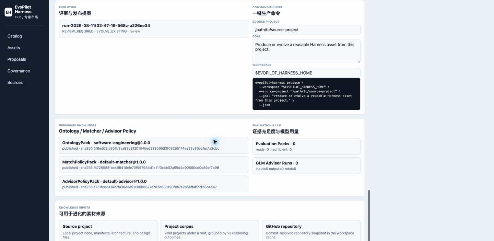

# EvoPilot Harness

[](https://github.com/yeliang-wang/evopilot-harness/actions/workflows/ci.yml)
[](https://github.com/yeliang-wang/evopilot-harness/releases)
[](package.json)
[](LICENSE)

> An Agent-native, user-owned Harness asset factory for turning model-external execution environments, actions, constraints, evidence, and validators into reusable production assets.

`evopilot-harness` ingests project and operational evidence, determines whether it belongs in a Harness, proposes a new or evolved asset, enforces human review, and publishes immutable assets and executable Bundles through user-owned Catalogs. In v4, a human talks to a portable Digital Expert loaded by Codex or another compatible Agent; the Agent operates the deterministic Engine through a local stdio MCP process. It runs independently from EvoPilot and Dashboard.



[Documentation](docs/README.md) | [Agent Quickstart](docs/agent/quickstart.md) | [npm Distribution](docs/operations/npm-distribution.md) | [How It Works](docs/guides/how-harness-works.md) | [Architecture](docs/architecture/overview.md) | [MCP Reference](docs/agent/mcp-reference.md) | [Release Notes](docs/releases/README.md)

## What A Harness Is

A Harness is a versioned executable asset package for one class of repeatable engineering task. It defines what a model may act on, what it must not do, which evidence it must produce, and which validators decide whether the work is acceptable.

| Asset | Responsibility |
|---|---|
| `HarnessComponent` | Atomic environment, action, constraint, evidence, and validator capability. |
| `HarnessProfile` | Domain, role, and task composition built from Components. |
| `HarnessBundle` | Immutable execution publication with pinned Profile and Component digests. |
| `OntologyPack` | Versioned concepts and role relationships used for reasoning. |
| `MatchPolicyPack` | Eligibility, retrieval, scoring, thresholds, and risk rules. |
| `AdvisorPolicyPack` | Evidence-bound GLM output contract and authority limits. |
| `EvaluationPack` | Portable positive/negative decision cases, validators, scorers, baselines, and regression boundaries. |
| `AssetDeltaProposal` | Evidence-linked before/after asset state plus compatibility, impact, expected-effect, regression, and rollback analysis. |
| `HarnessExecutionFeedbackPackage` | Approved, redacted execution evidence bound to one immutable Bundle closure. |
| `HarnessEffectivenessReport` | Outcome, Process, Safety, and Cost aggregation with sample, context, provenance, and uncertainty. |

This is intentionally narrower than general software classification. Unknown domains without discriminating evidence stop at `NEED_MORE_EVIDENCE`; they are not silently turned into generic or published assets.

## Quick Start

Requires Node.js 22.14 or newer. For a version that is present in the public registry, install the exact immutable package in a dedicated runtime directory:

```bash
npm view @evopilot/harness@4.0.2 version
mkdir -p "$HOME/.evopilot-harness-runtime"
cd "$HOME/.evopilot-harness-runtime"
npm init -y
npm install --save-exact @evopilot/harness@4.0.2
./node_modules/.bin/evopilot-harness agent bootstrap \
  --host workbuddy \
  --workspace "$HOME/.evopilot-harness" \
  --json
```

The `npm view` command is a publication gate, not an optional convenience. Until it returns the exact version, use a locally verified release tarball or a source checkout and do not claim public npm availability. The bootstrap result identifies the packaged Adapter, exact version-pinned `npx` MCP command, supported protocols, and external Workspace without changing the Agent host.

Load the returned Adapter in Codex, WorkBuddy, Claude Code, or another compatible host. Then configure the host with the returned local stdio MCP command. Source development may use `node /absolute/path/to/evopilot-harness/src/index.mjs`; installed operation does not require the repository checkout.

Then tell the Agent:

```text
使用 /absolute/path/to/project 作为只读 source project，
引导我生成或进化一个可复用 Harness；先给我看 Operation Plan，
自动展示 Engine Proposal Review，并分别停在批准和发布决策点。
```

The Digital Expert asks one missing question at a time. The human does not enter Harness lifecycle CLI commands. The Agent starts MCP, prepares the external Workspace, persists an `AgentOperationSession`, calls the Engine, renders the complete Review, and stops for explicit digest-bound decisions. Planned operations use durable idempotency receipts; interrupted unknown outcomes fail closed, and maintenance publication has a separate operation authorization. Project roots, Git repositories, attachments, production logs, historical Harnesses, notes, feedback, maintenance, diagnostics, resume, cancellation, close, and owned-session cleanup are covered. Source ingestion remains static and never runs project build, test, deploy, or business commands.

See [Agent-native quickstart](docs/agent/quickstart.md), [npm distribution](docs/operations/npm-distribution.md), [Digital Expert](docs/agent/digital-expert.md), [MCP reference](docs/agent/mcp-reference.md), and [Session protocol](docs/agent/session-protocol.md).

## Atomic CLI Compatibility

The v3 JSON CLI remains supported for CI, existing automation, compatibility, and emergency diagnosis. It is not the ordinary v4 human journey:

Process one approved structured execution-feedback package without creating a Proposal or mutating assets:

```bash
node src/index.mjs feedback process /path/to/feedback.yaml \
  --workspace "$EVOPILOT_HARNESS_HOME" \
  --json
```

`--production-log` remains unstructured, redacted source material for Proposal reasoning. A `HarnessExecutionFeedbackPackage` is a separate governed contract with approval, redaction, expiry, provenance, package/payload digests, and exact published Bundle/Profile/Component binding. See [Feedback Evidence](docs/guides/feedback-evidence.md).

## Reasoning And Review

The v3 pipeline combines deterministic controls with evidence-bound model advice:

```mermaid
flowchart LR
  Sources["Projects, GitHub, attachments, logs, notes"] --> Graph["Redacted Evidence Graph"]
  Graph --> Gate["Harness Eligibility Gate"]
  Gate --> Match["Ontology + BM25 + factor scoring"]
  Match --> Advisor["Evidence-bound GLM Advisor Run"]
  Advisor --> Proposal["Typed Asset Delta Proposal"]
  Proposal --> Closure["Evaluation + impact closure"]
  Closure --> Review["Proposal Review Engine"]
  Review --> Human["Human approval + evaluation"]
  Human --> Catalog["Immutable assets + Catalog"]
```



The deterministic boundary emits:

- `EVOLVE_EXISTING`
- `COMPOSE_NEW_BUNDLE`
- `PROPOSE_NEW_PROFILE`
- `NO_CHANGE`
- `NEED_MORE_EVIDENCE`

`NOT_HARNESS_ELIGIBLE` remains an earlier eligibility stop and creates no asset delta. The five Proposal decisions are mutually exclusive. `NO_CHANGE` and `NEED_MORE_EVIDENCE` retain an auditable Proposal but set `publicationAllowed=false`; approval and publication are blocked.

GLM may explain ambiguity and recommend deltas, but it cannot approve, publish, execute source code, mutate `models.json`, invent evidence, or override schema, policy, evaluation, signature, and human-review gates. Every Advisor attempt, including failure and skip states, is persisted as a redacted Advisor Run. Large Evidence Graphs pass through a deterministic, Policy-budgeted projection that preserves reasoning citations and source/kind coverage while retaining the complete Graph for audit. Advisor Policy may also permit one structure/citation-only repair after a rejected response; both attempts remain validated, metered, and auditable. `llm v3-models` checks configuration only; `llm v3-doctor` proves live connectivity.

Every mutating Proposal contains exact before/after asset documents and digests, evidence-linked JSON-pointer changes, an `EvaluationPack v3`, and deterministic compatibility, dependency, blast-radius, expected-effect, regression, and rollback analysis. Closure validates embedded asset schemas and recomputes proposed-asset, Evaluation, Catalog-baseline, change, and impact bindings instead of trusting editable fields. Validate that closure independently before semantic review:

```bash
node src/index.mjs proposal validate <proposal-id> \
  --workspace "$EVOPILOT_HARNESS_HOME" \
  --json
```

Every `produce` run stops before review or returns a terminal/blocked decision. A required Advisor failure keeps the evidence and Proposal for diagnosis, returns a non-zero exit code, and cannot proceed. `proposal review` runs deterministic Delta/Evaluation gates plus an independent evidence-bound semantic reviewer and persists a structured report:

```bash
node src/index.mjs proposal review <proposal-id> \
  --workspace "$EVOPILOT_HARNESS_HOME" \
  --models-file /path/to/models.json \
  --json

node src/index.mjs proposal approve <proposal-id> \
  --workspace "$EVOPILOT_HARNESS_HOME" \
  --confirmed-by admin@example.com \
  --confirmation "Reviewed evidence, reasoning, Advisor citations, asset boundary, and evaluation case." \
  --evaluation-reviewed \
  --json

node src/index.mjs proposal publish <proposal-id> \
  --workspace "$EVOPILOT_HARNESS_HOME" \
  --json
```

All three mutating decisions require reviewed positive/negative Evaluation cases and a `READY` EvaluationPack. Approval binds the current Review Report and approved Proposal content by digest; publication rechecks both and rebuilds Delta after-states from the exact immutable documents being written.

## Ownership Boundary

| System | Owns |
|---|---|
| `evopilot-harness` | Evidence ingestion, reasoning, authoring, evolution, review, approval, evaluation, publication, Catalog/Registry, CLI, and Harness Hub. |
| EvoPilot | Project onboarding, project-to-Harness matching, goal-loop execution, project evidence, and release decisions. |
| Dashboard | Navigation and optional Harness Hub embedding; no Harness lifecycle state. |

The canonical v3 asset uses `harness.evopilot.io/v3` and is product-neutral. A Bundle may include `exports/evopilot/template.yaml`, but that projection is not the source of truth. A compatible control plane may read Profile metadata while matching; execution must bind a published immutable Bundle.

## Independent Versions

Engine, Harness assets, Ontology, Policy, Evaluation, and Catalog each have their own version or digest. Publishing or evolving a user Harness does not require an Engine, EvoPilot, or Dashboard release.

The Engine checkout is read-only during production. User assets, evidence, policies, runs, evaluations, keys, and Catalogs live under `EVOPILOT_HARNESS_HOME`.

## Compatibility

The Engine `4.0.2` source line retains the v3 JSON CLI, v3 Harness assets and Workspace state, Proposal history, Catalog, Registry, feedback packages, and EvaluationPack v1/v2 read compatibility. New v3 approval automation must pass Asset Delta closure and the Proposal Review Engine first; existing v2 automation can follow the [v2 compatibility guide](docs/guides/v2-compatibility.md).

GitHub Release, npm publication, and optional GHCR publication are separate evidence layers. Check each registry before claiming it is published. v4.0.2 does not add v4.1 Pairwise/Champion-Challenger comparison or v4.2 professional asset learning.

## Validate

```bash
npm test
npm run v3:check
npm run digital-expert:check
npm run check
```

Evaluation reports `INSUFFICIENT_EVAL_EVIDENCE` until enough independently reviewed cases exist. Passing fixtures proves contract behavior, not open-domain matching accuracy.

## Documentation

- [Documentation index](docs/README.md)
- [CLI quickstart](docs/cli/quickstart.md)
- [Agent-native quickstart](docs/agent/quickstart.md)
- [Digital Expert and Adapter import](docs/agent/digital-expert.md)
- [MCP reference](docs/agent/mcp-reference.md)
- [npm distribution and installed Agent operation](docs/operations/npm-distribution.md)
- [Agent Operation Session protocol](docs/agent/session-protocol.md)
- [v3 production lifecycle](docs/guides/v3-production-lifecycle.md)
- [v3 asset model](docs/architecture/v3-asset-model.md)
- [v3 reasoning contract](docs/reference/v3-reasoning-contract.md)
- [Asset Delta and Evaluation](docs/guides/asset-delta-and-evaluation.md)
- [Harness Hub integration](docs/guides/harness-hub-integration.md)
- [Development](docs/development.md)
- [Security](SECURITY.md)
- [Contributing](CONTRIBUTING.md)

Licensed under [Apache License 2.0](LICENSE).
