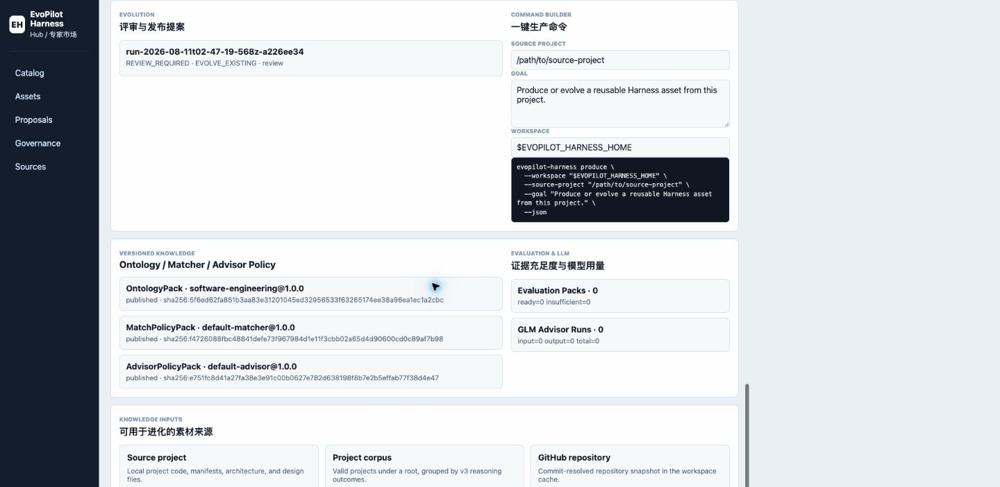
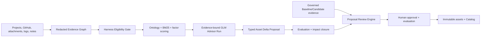

# EvoPilot Harness

[](https://github.com/yeliang-wang/evopilot-harness/actions/workflows/ci.yml)
[](https://github.com/yeliang-wang/evopilot-harness/releases)
[](https://www.npmjs.com/package/@evopilot/harness/v/4.8.0)
[](package.json)
[](LICENSE)

> Build reusable, user-owned Harness assets from evidence through your Agent and the deterministic local Engine.

`evopilot-harness` turns evidence into reviewed, immutable Harness assets and Bundles in user-owned Catalogs. Its portable Digital Expert guides Codex or another compatible Agent through local stdio MCP to the deterministic Engine, independently of EvoPilot and Dashboard.

Current published release: [`v4.8.0`](https://github.com/yeliang-wang/evopilot-harness/releases/tag/v4.8.0), also available as [`@evopilot/harness@4.8.0`](https://www.npmjs.com/package/@evopilot/harness/v/4.8.0) with Registry signatures and SLSA provenance.

This source tree targets **4.8.1 semantic Catalog supply**, not yet accepted or
published. Engine version changes do not rewrite existing semantic asset versions,
schemas or published digests. Candidate installation and Release remain separate.



[Documentation](docs/README.md) | [Agent Quickstart](docs/agent/quickstart.md) | [Controlled Comparison](docs/guides/controlled-comparative-evidence.md) | [npm Distribution](docs/operations/npm-distribution.md) | [How It Works](docs/guides/how-harness-works.md) | [Architecture](docs/architecture/overview.md) | [MCP Reference](docs/agent/mcp-reference.md) | [Release Notes](docs/releases/README.md)

## What A Harness Is

A Harness is a versioned executable asset package for one class of repeatable engineering task. It defines what a model may act on, what it must not do, which evidence it must produce, and which validators decide whether the work is acceptable.

| Asset | Responsibility |
|---|---|
| `HarnessComponent` | Atomic environment, action, constraint, evidence, and validator capability. |
| `HarnessProfile` | Domain, role, and task composition built from Components. |
| `HarnessBundle` | Immutable execution publication with pinned Profile and Component digests. |
| `OntologyPack` | Versioned concepts and role relationships used for reasoning. |
| `MatchPolicyPack` | Eligibility, retrieval, scoring, thresholds, and risk rules. |
| `AdvisorPolicyPack` | Evidence-bound GLM output contract and authority limits. |
| `EvaluationPack` | Portable positive/negative decision cases, validators, scorers, baselines, and regression boundaries. |
| `AssetDeltaProposal` | Evidence-linked before/after asset state plus compatibility, impact, expected-effect, regression, and rollback analysis. |
| `HarnessExecutionFeedbackPackage` | Approved, redacted execution evidence bound to one immutable Bundle closure. |
| `HarnessEffectivenessReport` | Outcome, Process, Safety, and Cost aggregation with sample, context, provenance, and uncertainty. |
| `HarnessComparisonEvidencePackage` | Approved, redacted Baseline/Candidate observations bound to exact assets, task, environment, Evaluation, and scorer versions. |
| `HarnessComparisonReport` | Deterministic paired metrics, comparability, uncertainty, conflicts, safety blockers, limitations, and one non-authorizing recommendation. |
| `HarnessCalibrationCaseSet` | Independently reviewed matching and Proposal cases for Baseline/Candidate policy replay. |
| `HarnessCalibrationReport` | Policy ranking, abstention, false upgrade, false new profile, regression, conflicts, and uncertainty without active-policy mutation. |

This is intentionally narrower than general software classification. Unknown domains without discriminating evidence stop at `NEED_MORE_EVIDENCE`; they are not silently turned into generic or published assets.

## Quick Start

Requires Node.js 22.14 or newer. For a version that is present in the public registry, install the exact immutable package in a dedicated runtime directory:

```bash
npm view @evopilot/harness@4.3.0 version
mkdir -p "$HOME/.evopilot-harness-runtime"
cd "$HOME/.evopilot-harness-runtime"
npm init -y
npm install --save-exact @evopilot/harness@4.3.0
./node_modules/.bin/evopilot-harness agent bootstrap \
  --host workbuddy \
  --workspace "$HOME/.evopilot-harness" \
  --json
```

`npm view` must confirm the exact public version; otherwise use a verified local tarball or source checkout. Bootstrap reports the packaged Adapter, pinned MCP command, protocols and external Workspace without changing the Host. WorkBuddy installation has its own preview-bound confirmation:

```bash
evopilot-harness agent install --host workbuddy --workspace "$HOME/.evopilot-harness" --json
# Review the plan, then repeat with --confirm <planDigest>.
```

Load the returned Adapter in Codex, WorkBuddy, Claude Code, or another compatible host. Then configure the host with the returned local stdio MCP command. Source development may use `node /absolute/path/to/evopilot-harness/src/index.mjs`; installed operation does not require the repository checkout.

Then tell the Agent:

```text
使用 /absolute/path/to/project 作为只读 source project，
引导我生成或进化一个可复用 Harness；先给我看 Operation Plan，
自动展示 Engine Proposal Review，并分别停在批准和发布决策点。
```

The Digital Expert asks one missing question at a time and operates MCP. `AgentOperationSession` persists the Plan, full Review and separate decisions. Receipts protect interrupted operations; maintenance publication needs separate authorization. Comparison, calibration and Professional Completeness reports require separate review acknowledgement. The [MCP reference](docs/agent/mcp-reference.md) covers Sources, feedback, learning, maintenance, diagnostics and recovery. Static ingestion never runs Source build, test, deploy, business, adapter or network acquisition commands.

## Atomic CLI Compatibility

The v3 JSON CLI supports CI, existing automation and emergency diagnosis:

Process one approved structured execution-feedback package without creating a Proposal or mutating assets:

```bash
node src/index.mjs feedback process /path/to/feedback.yaml \
  --workspace "$EVOPILOT_HARNESS_HOME" \
  --json
```

`--production-log` remains unstructured, redacted source material for Proposal reasoning. A `HarnessExecutionFeedbackPackage` is a separate governed contract with approval, redaction, expiry, provenance, package/payload digests, and exact published Bundle/Profile/Component binding. See [Feedback Evidence](docs/guides/feedback-evidence.md).

Process one approved Baseline/Candidate package and return an immutable report without approving, publishing, rolling back, activating policy, or executing either asset:

```bash
node src/index.mjs comparison process /path/to/comparison.yaml \
  --workspace "$EVOPILOT_HARNESS_HOME" \
  --json
```

Reports bind the exact task, Source, environment, model, toolchain, Evaluation, scorer, metrics and assets. Rescoring preserves prior reports; reviewed calibration replays explicit policies without activating them. See [Controlled Comparative Evidence](docs/guides/controlled-comparative-evidence.md).

The v4.2 candidate adds append-only Asset Curriculum, reviewed static Research and Contribution evidence, immutable Evidence Run manifests, vector Professional Completeness reporting, and evidence-derived Domain/Role proposals. It does not add web crawling, executable adapters, model training, automatic approval, or automatic publication. See [Professional Asset Learning](docs/guides/professional-asset-learning.md).

## Reasoning And Review

The v3 pipeline combines deterministic controls with evidence-bound model advice:


```mermaid
flowchart LR
  Sources["Projects, GitHub, attachments, logs, notes"] --> Graph["Redacted Evidence Graph"]
  Graph --> Gate["Harness Eligibility Gate"]
  Gate --> Match["Ontology + BM25 + factor scoring"]
  Match --> Advisor["Evidence-bound GLM Advisor Run"]
  Advisor --> Proposal["Typed Asset Delta Proposal"]
  Proposal --> Closure["Evaluation + impact closure"]
  Comparison["Governed Baseline/Candidate evidence"] --> Review
  Closure --> Review["Proposal Review Engine"]
  Review --> Human["Human approval + evaluation"]
  Human --> Catalog["Immutable assets + Catalog"]
```

The deterministic boundary emits:

- `EVOLVE_EXISTING`
- `COMPOSE_NEW_BUNDLE`
- `PROPOSE_NEW_PROFILE`
- `NO_CHANGE`
- `NEED_MORE_EVIDENCE`

`NOT_HARNESS_ELIGIBLE` remains an earlier eligibility stop and creates no asset delta. The five Proposal decisions are mutually exclusive. `NO_CHANGE` and `NEED_MORE_EVIDENCE` retain an auditable Proposal but set `publicationAllowed=false`; approval and publication are blocked.

GLM advice cannot approve, publish, execute Sources, change `models.json`, invent evidence or override gates. Redacted Advisor Runs retain failures and skips. Policy-budgeted Graph projections preserve citations and Source/kind coverage; the full Graph remains in audit. Policy may allow one structure/citation repair, with both attempts validated and metered. `llm v3-models` checks configuration; `llm v3-doctor` tests live connectivity.

Mutating Proposals contain exact before/after assets, cited changes, `EvaluationPack v3`, compatibility, dependencies, impact, expected effects, regression and rollback analysis. Closure validates schemas and recomputes asset, Evaluation, Catalog-baseline, change and impact bindings. Validate it before semantic review:

```bash
node src/index.mjs proposal validate <proposal-id> \
  --workspace "$EVOPILOT_HARNESS_HOME" \
  --json
```

Every `produce` run stops before review or returns a terminal/blocked decision. A required Advisor failure keeps the evidence and Proposal for diagnosis, returns a non-zero exit code, and cannot proceed. `proposal review` runs deterministic Delta/Evaluation gates plus an independent evidence-bound semantic reviewer and persists a structured report:

```bash
node src/index.mjs proposal review <proposal-id> \
  --workspace "$EVOPILOT_HARNESS_HOME" \
  --models-file /path/to/models.json \
  --json

node src/index.mjs proposal approve <proposal-id> \
  --workspace "$EVOPILOT_HARNESS_HOME" \
  --confirmed-by admin@example.com \
  --confirmation "Reviewed evidence, reasoning, Advisor citations, asset boundary, and evaluation case." \
  --evaluation-reviewed \
  --json

node src/index.mjs proposal publish <proposal-id> \
  --workspace "$EVOPILOT_HARNESS_HOME" \
  --json
```

All mutating decisions require reviewed positive/negative cases and a `READY` EvaluationPack. Review distinguishes expected effects from comparative evidence. Approval binds the Review and Proposal digests; publication rechecks both and derives Delta after-states from the written immutable assets. Changed comparison evidence, conflicts, tampering or digest drift block either decision.

## Ownership Boundary

| System | Owns |
|---|---|
| `evopilot-harness` | Evidence ingestion, reasoning, authoring, evolution, review, approval, evaluation, publication, Catalog/Registry, CLI, and Harness Hub. |
| EvoPilot | Project onboarding, project-to-Harness matching, goal-loop execution, project evidence, and release decisions. |
| Dashboard | Navigation and optional Harness Hub embedding; no Harness lifecycle state. |

The canonical v3 asset uses `harness.evopilot.io/v3` and is product-neutral. A Bundle may include `exports/evopilot/template.yaml`, but that projection is not the source of truth. A compatible control plane may read Profile metadata while matching; execution must bind a published immutable Bundle.

## Independent Versions

Engine, Harness assets, Ontology, Policy, Evaluation, and Catalog each have their own version or digest. Publishing or evolving a user Harness does not require an Engine, EvoPilot, or Dashboard release.

The Engine checkout is read-only during production. User assets, evidence, policies, runs, evaluations, keys, and Catalogs live under `EVOPILOT_HARNESS_HOME`.

## Compatibility

The Engine `4.1.2` source line retains the v3 JSON CLI, v3 Harness assets and Workspace state, Proposal history, Catalog, Registry, feedback packages, v4 Agent Sessions, and EvaluationPack v1/v2 read compatibility. Legacy Sessions without `evidenceReports` remain readable. New approval automation must pass Asset Delta closure and the Proposal Review Engine first; existing v2 automation can follow the [v2 compatibility guide](docs/guides/v2-compatibility.md).

GitHub Release and npm publication are separate release evidence layers and require explicit authorization. Container publication and deployment are outside this npm-and-MCP distribution scope and are not release prompts.

## Validate

```bash
npm test
npm run v3:check
npm run digital-expert:check
npm run check
```

Evaluation reports `INSUFFICIENT_EVAL_EVIDENCE` until enough independently reviewed cases exist. Passing fixtures proves contract behavior, not open-domain matching accuracy.

## Documentation

- [Documentation index](docs/README.md)
- [CLI quickstart](docs/cli/quickstart.md)
- [Agent-native quickstart](docs/agent/quickstart.md)
- [Digital Expert and Adapter import](docs/agent/digital-expert.md)
- [MCP reference](docs/agent/mcp-reference.md)
- [npm distribution and installed Agent operation](docs/operations/npm-distribution.md)
- [Agent Operation Session protocol](docs/agent/session-protocol.md)
- [v3 production lifecycle](docs/guides/v3-production-lifecycle.md)
- [v3 asset model](docs/architecture/v3-asset-model.md)
- [v3 reasoning contract](docs/reference/v3-reasoning-contract.md)
- [Asset Delta and Evaluation](docs/guides/asset-delta-and-evaluation.md)
- [Controlled comparative evidence and calibration](docs/guides/controlled-comparative-evidence.md)
- [Harness Hub integration](docs/guides/harness-hub-integration.md)
- [Development](docs/development.md)
- [Security](SECURITY.md)
- [Contributing](CONTRIBUTING.md)

Licensed under [Apache License 2.0](LICENSE).
