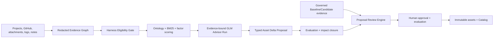

# EvoPilot Harness

[](https://github.com/yeliang-wang/evopilot-harness/actions/workflows/ci.yml)
[](https://github.com/yeliang-wang/evopilot-harness/releases)
[](https://www.npmjs.com/package/@evopilot/harness/v/4.8.1)
[](package.json)
[](LICENSE)

> Build user-owned Harness assets from evidence with your Agent and local Engine.

`evopilot-harness` creates reviewed, immutable assets in user-owned Catalogs. Its Digital Expert guides compatible Agents through local stdio MCP to the deterministic Engine, independently of EvoPilot and Dashboard.

Current published release: [`v4.8.1`](https://github.com/yeliang-wang/evopilot-harness/releases/tag/v4.8.1), also available as [`@evopilot/harness@4.8.1`](https://www.npmjs.com/package/@evopilot/harness/v/4.8.1) with Registry signatures and SLSA provenance.

**4.8.1 semantic Catalog supply is accepted and published.** See the
[current release and acceptance limits](https://github.com/yeliang-wang/evopilot-harness/blob/main/docs/releases/current-release.md).
Engine version changes do not rewrite existing semantic asset versions, schemas
or published digests.


[Documentation](https://github.com/yeliang-wang/evopilot-harness/blob/main/docs/README.md) | [Agent Quickstart](https://github.com/yeliang-wang/evopilot-harness/blob/main/docs/agent/quickstart.md) | [Controlled Comparison](https://github.com/yeliang-wang/evopilot-harness/blob/main/docs/guides/controlled-comparative-evidence.md) | [npm Distribution](https://github.com/yeliang-wang/evopilot-harness/blob/main/docs/operations/npm-distribution.md) | [How It Works](https://github.com/yeliang-wang/evopilot-harness/blob/main/docs/guides/how-harness-works.md) | [Architecture](https://github.com/yeliang-wang/evopilot-harness/blob/main/docs/architecture/overview.md) | [MCP Reference](https://github.com/yeliang-wang/evopilot-harness/blob/main/docs/agent/mcp-reference.md) | [Release Notes](https://github.com/yeliang-wang/evopilot-harness/blob/main/docs/releases/README.md)

## What A Harness Is

A Harness is a versioned executable package for a repeatable engineering task. It defines model permissions, required evidence, constraints and acceptance validators.

| Asset | Responsibility |
|---|---|
| `HarnessComponent` | Atomic environment, action, constraint, evidence, and validator capability. |
| `HarnessProfile` | Domain, role, and task composition built from Components. |
| `HarnessBundle` | Immutable execution publication with pinned Profile and Component digests. |
| `OntologyPack` | User-owned published concepts and role relationships used by the compatibility producer. |
| `MatchPolicyPack` | Eligibility, retrieval, scoring, thresholds, and risk rules. |
| `AdvisorPolicyPack` | Evidence-bound GLM output contract and authority limits. |
| `EvaluationPack` | Portable positive/negative decision cases, validators, scorers, baselines, and regression boundaries. |
| `AssetDeltaProposal` | Evidence-linked before/after asset state plus compatibility, impact, expected-effect, regression, and rollback analysis. |
| `HarnessExecutionFeedbackPackage` | Approved, redacted execution evidence bound to one immutable Bundle closure. |
| `HarnessEffectivenessReport` | Outcome, Process, Safety, and Cost aggregation with sample, context, provenance, and uncertainty. |
| `HarnessComparisonEvidencePackage` | Approved, redacted Baseline/Candidate observations bound to exact assets, task, environment, Evaluation, and scorer versions. |
| `HarnessComparisonReport` | Deterministic paired metrics, comparability, uncertainty, conflicts, safety blockers, limitations, and one non-authorizing recommendation. |
| `HarnessCalibrationCaseSet` | Independently reviewed matching and Proposal cases for Baseline/Candidate policy replay. |
| `HarnessCalibrationReport` | Policy ranking, abstention, false upgrade, false new profile, regression, conflicts, and uncertainty without active-policy mutation. |

This is intentionally narrower than general software classification. Unknown domains without discriminating evidence stop at `NEED_MORE_EVIDENCE`; they are not silently turned into generic or published assets.

## Quick Start

Requires Node.js 22.14 or newer and an Agent that can load local instructions and launch stdio MCP. For the Runtime + Evolution Expert + Harness combination, start with the [series installation guide](https://github.com/yeliang-wang/evopilot/blob/main/docs/guides/agent-host-installation.md). Harness alone can be installed in a dedicated runtime directory:

```bash
npm view @evopilot/harness@4.8.1 version
mkdir -p "$HOME/.evopilot-harness-runtime"
cd "$HOME/.evopilot-harness-runtime"
npm init -y
npm install --save-exact @evopilot/harness@4.8.1
./node_modules/.bin/evopilot-harness agent bootstrap \
  --host codex \
  --workspace "$HOME/.evopilot-harness" \
  --json
```

`npm view` must confirm the exact public version; otherwise use a verified local tarball or source checkout. Bootstrap reports the packaged Adapter, pinned MCP command, protocols and external Workspace without changing the Host. Load its `adapter.path` and configure its `mcp.exactNpxCommand` in the Host. For a local installation, configure the **absolute** installed binary path; a bare `evopilot-harness` command requires an existing `PATH` entry.

Follow the [Agent Quickstart](https://github.com/yeliang-wang/evopilot-harness/blob/main/docs/agent/quickstart.md) to activate the Adapter, check the live MCP connection, reuse existing model configuration, and run a first classification task. WorkBuddy has a separate preview-bound installer; Codex uses bootstrap plus manual Adapter/MCP configuration. A packaged Adapter is not proof of compatibility with every Host version. The current release's live acceptance is Codex-only.

Then tell the Agent:

```text
使用 /absolute/path/to/project 作为只读 source project，
使用 /absolute/path/to/taxonomy.yaml 作为我的业务分类方案。
复用当前已验证的模型配置，先完成分类分析并展示结果，
停在是否继续 Harness 演进的选择处。
```

Replace both paths with existing inputs. A fresh Workspace contains generic validation capabilities and policies, with no professional Profile, Bundle or business vocabulary. Missing knowledge can correctly produce `NEED_MORE_EVIDENCE`; installation does not supply business evidence or publication authority. The Digital Expert asks only for missing information and operates MCP. `AgentOperationSession` preserves the Plan, full Review and separate decisions. The [MCP reference](https://github.com/yeliang-wang/evopilot-harness/blob/main/docs/agent/mcp-reference.md) covers the later production lifecycle and recovery. Source ingestion is static and never runs Source build, test, deploy, business or adapter commands; GitHub acquisition is a separate bounded read-only source resolver.

## Atomic CLI Compatibility

The v3 JSON CLI supports CI, existing automation and emergency diagnosis. Run these examples from the installation directory above; a source checkout can instead use `node src/index.mjs`.

Process one approved structured execution-feedback package without creating a Proposal or mutating assets:

```bash
./node_modules/.bin/evopilot-harness feedback process /path/to/feedback.yaml \
  --workspace "$EVOPILOT_HARNESS_HOME" \
  --json
```

`--production-log` remains unstructured, redacted source material for Proposal reasoning. A `HarnessExecutionFeedbackPackage` is a separate governed contract with approval, redaction, expiry, provenance, package/payload digests, and exact published Bundle/Profile/Component binding. See [Feedback Evidence](https://github.com/yeliang-wang/evopilot-harness/blob/main/docs/guides/feedback-evidence.md).

Process one approved Baseline/Candidate package and return an immutable report without approving, publishing, rolling back, activating policy, or executing either asset:

```bash
./node_modules/.bin/evopilot-harness comparison process /path/to/comparison.yaml \
  --workspace "$EVOPILOT_HARNESS_HOME" \
  --json
```

Reports bind the exact task, Source, environment, model, toolchain, Evaluation, scorer, metrics and assets. Rescoring preserves prior reports; reviewed calibration replays explicit policies without activating them. See [Controlled Comparative Evidence](https://github.com/yeliang-wang/evopilot-harness/blob/main/docs/guides/controlled-comparative-evidence.md).

The retained v4.2 capabilities include append-only Asset Curriculum, reviewed static Research and Contribution evidence, immutable Evidence Run manifests, vector Professional Completeness reporting, and evidence-derived Domain/Role proposals. It does not add web crawling, executable adapters, model training, automatic approval, or automatic publication. See [Professional Asset Learning](https://github.com/yeliang-wang/evopilot-harness/blob/main/docs/guides/professional-asset-learning.md).

## Reasoning And Review

The v3 pipeline combines deterministic controls with evidence-bound model advice:


```mermaid
flowchart LR
  Sources["Projects, GitHub, attachments, logs, notes"] --> Graph["Redacted Evidence Graph"]
  Graph --> Gate["Harness Eligibility Gate"]
  Gate --> Match["Ontology + BM25 + factor scoring"]
  Match --> Advisor["Evidence-bound GLM Advisor Run"]
  Advisor --> Proposal["Typed Asset Delta Proposal"]
  Proposal --> Closure["Evaluation + impact closure"]
  Comparison["Governed Baseline/Candidate evidence"] --> Review
  Closure --> Review["Proposal Review Engine"]
  Review --> Human["Human approval + evaluation"]
  Human --> Catalog["Immutable assets + Catalog"]
```

The deterministic boundary emits:

- `EVOLVE_EXISTING`
- `COMPOSE_NEW_BUNDLE`
- `PROPOSE_NEW_PROFILE`
- `NO_CHANGE`
- `NEED_MORE_EVIDENCE`

`NOT_HARNESS_ELIGIBLE` remains an earlier eligibility stop and creates no asset delta. The five Proposal decisions are mutually exclusive. `NO_CHANGE` and `NEED_MORE_EVIDENCE` retain an auditable Proposal but set `publicationAllowed=false`; approval and publication are blocked.

GLM advice cannot approve, publish, execute Sources, change `models.json`, invent evidence or override gates. Redacted Advisor Runs retain failures and skips. Policy-budgeted Graph projections preserve citations and Source/kind coverage; the full Graph remains in audit. Policy may allow one structure/citation repair, with both attempts validated and metered. `llm v3-models` checks configuration; `llm v3-doctor` tests live connectivity.

Mutating Proposals contain exact before/after assets, cited changes, `EvaluationPack v3`, compatibility, dependencies, impact, expected effects, regression and rollback analysis. Closure validates schemas and recomputes asset, Evaluation, Catalog-baseline, change and impact bindings. Validate it before semantic review:

```bash
./node_modules/.bin/evopilot-harness proposal validate <proposal-id> \
  --workspace "$EVOPILOT_HARNESS_HOME" \
  --json
```

Every `produce` run stops before review or returns a terminal/blocked decision. A required Advisor failure keeps the evidence and Proposal for diagnosis, returns a non-zero exit code, and cannot proceed. `proposal review` runs deterministic Delta/Evaluation gates plus an independent evidence-bound semantic reviewer and persists a structured report:

```bash
./node_modules/.bin/evopilot-harness proposal review <proposal-id> \
  --workspace "$EVOPILOT_HARNESS_HOME" \
  --models-file /path/to/models.json \
  --json

./node_modules/.bin/evopilot-harness proposal approve <proposal-id> \
  --workspace "$EVOPILOT_HARNESS_HOME" \
  --confirmed-by admin@example.com \
  --confirmation "Reviewed evidence, reasoning, Advisor citations, asset boundary, and evaluation case." \
  --evaluation-reviewed \
  --json

./node_modules/.bin/evopilot-harness proposal publish <proposal-id> \
  --workspace "$EVOPILOT_HARNESS_HOME" \
  --json
```

All mutating decisions require reviewed positive/negative cases and a `READY` EvaluationPack. Review distinguishes expected effects from comparative evidence. Approval binds the Review and Proposal digests; publication rechecks both and derives Delta after-states from the written immutable assets. Changed comparison evidence, conflicts, tampering or digest drift block either decision.

## Ownership Boundary

| System | Owns |
|---|---|
| `evopilot-harness` | Evidence ingestion, reasoning, authoring, evolution, review, approval, evaluation, publication, Catalog/Registry, CLI, and Harness Hub. |
| EvoPilot | Project onboarding, project-to-Harness matching, goal-loop execution, project evidence, and release decisions. |
| Dashboard | Navigation and optional Harness Hub embedding; no Harness lifecycle state. |

The canonical v3 asset uses `harness.evopilot.io/v3` and is product-neutral. A Bundle may include `exports/evopilot/template.yaml`, but that projection is not the source of truth. A compatible control plane may read Profile metadata while matching; execution must bind a published immutable Bundle.

## Independent Versions

Engine, assets, Ontology, Policy, Evaluation, and Catalog versions or digests are independent. User Harness evolution and publication require no Engine, EvoPilot, or Dashboard release.

The Engine checkout is read-only during production. User assets, evidence, policies, runs, evaluations, keys, and Catalogs live under `EVOPILOT_HARNESS_HOME`.

## Compatibility

The current Engine is `4.8.1`; the canonical asset namespace remains `harness.evopilot.io/v3`, and Agent operations use `evopilot-harness-agent-operations/v3`. These protocol versions do not identify the Engine release. The v4.5 baseline reset does not support direct reading or migration of pre-v4.5 Workspace and Session representations. Historical v2/v3 CLI and migration material is retained in the [v2 compatibility guide](https://github.com/yeliang-wang/evopilot-harness/blob/main/docs/guides/v2-compatibility.md), not as a promise of direct upgrade to 4.8.1. See the [architecture compatibility section](https://github.com/yeliang-wang/evopilot-harness/blob/main/docs/architecture/overview.md#compatibility) and [current release limits](https://github.com/yeliang-wang/evopilot-harness/blob/main/docs/releases/current-release.md).

GitHub Release and npm publication are separate release evidence layers and require explicit authorization. Container publication and deployment are outside this npm-and-MCP distribution scope and are not release prompts.

## Validate

Contributors run these repository checks from a source checkout, not the npm installation directory:

```bash
npm test
npm run v3:check
npm run digital-expert:check
npm run check
```

Evaluation reports `INSUFFICIENT_EVAL_EVIDENCE` until enough independently reviewed cases exist. Passing fixtures proves contract behavior, not open-domain matching accuracy.

## Documentation

- [Documentation index](https://github.com/yeliang-wang/evopilot-harness/blob/main/docs/README.md)
- [CLI quickstart](https://github.com/yeliang-wang/evopilot-harness/blob/main/docs/cli/quickstart.md)
- [Agent-native quickstart](https://github.com/yeliang-wang/evopilot-harness/blob/main/docs/agent/quickstart.md)
- [Digital Expert and Adapter import](https://github.com/yeliang-wang/evopilot-harness/blob/main/docs/agent/digital-expert.md)
- [MCP reference](https://github.com/yeliang-wang/evopilot-harness/blob/main/docs/agent/mcp-reference.md)
- [npm distribution and installed Agent operation](https://github.com/yeliang-wang/evopilot-harness/blob/main/docs/operations/npm-distribution.md)
- [Agent Operation Session protocol](https://github.com/yeliang-wang/evopilot-harness/blob/main/docs/agent/session-protocol.md)
- [v3 production lifecycle](https://github.com/yeliang-wang/evopilot-harness/blob/main/docs/guides/v3-production-lifecycle.md)
- [v3 asset model](https://github.com/yeliang-wang/evopilot-harness/blob/main/docs/architecture/v3-asset-model.md)
- [v3 reasoning contract](https://github.com/yeliang-wang/evopilot-harness/blob/main/docs/reference/v3-reasoning-contract.md)
- [Asset Delta and Evaluation](https://github.com/yeliang-wang/evopilot-harness/blob/main/docs/guides/asset-delta-and-evaluation.md)
- [Controlled comparative evidence and calibration](https://github.com/yeliang-wang/evopilot-harness/blob/main/docs/guides/controlled-comparative-evidence.md)
- [Harness Hub integration](https://github.com/yeliang-wang/evopilot-harness/blob/main/docs/guides/harness-hub-integration.md)
- [Development](https://github.com/yeliang-wang/evopilot-harness/blob/main/docs/development.md)
- [Security](https://github.com/yeliang-wang/evopilot-harness/blob/main/SECURITY.md)
- [Contributing](https://github.com/yeliang-wang/evopilot-harness/blob/main/CONTRIBUTING.md)

Licensed under [Apache License 2.0](LICENSE).

### Business-neutral initialization

A fresh Workspace installs generic validation Components and policies. It does not install professional Profiles, Bundles, legacy templates, or business vocabulary as Built-in authority. Professional reasoning consumes published user-owned knowledge and Organization assets. Without applicable knowledge it preserves the independent Eligibility result and reports `NEED_MORE_EVIDENCE`; classification alone does not establish Eligibility or authorize publication.

Historical Built-in Catalog bytes are preserved during reinitialization. Their professional assets and packaged examples do not silently become producer authority. The legacy `detect`/`evolve` compatibility path accepts an explicitly supplied `--workspace` for published user knowledge and an explicit `--source` Catalog; it contains no universal business-role mapping. Professional regression data is installed explicitly into disposable test Workspaces. `npm run eval:run` runs that isolated fixture workflow.
