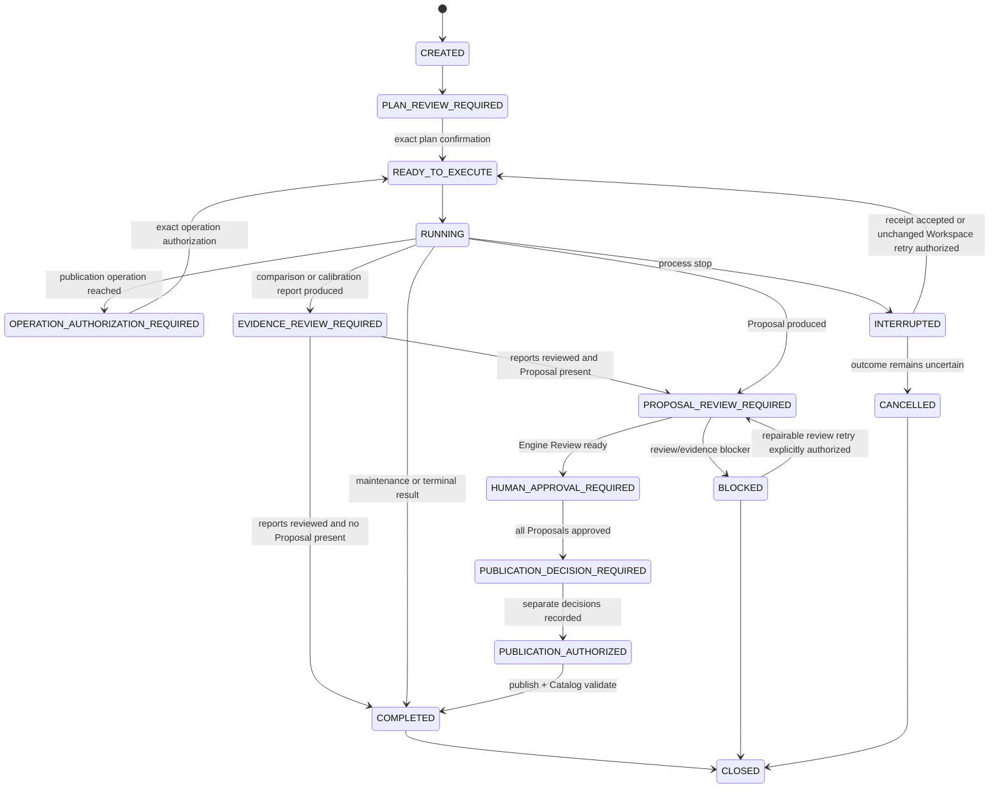

# Agent Operation Session Protocol

`AgentOperationSession` is the external Workspace system of record for an Agent-native operation. It replaces reliance on one Agent conversation and does not replace canonical Harness assets or Engine lifecycle files.

## Storage

```text
EVOPILOT_HARNESS_HOME/
  agent-operation-receipts/
    <idempotencyKey>.json
  agent-sessions/
    <sessionId>/
      .ownership.json
      session.json
      journal.jsonl
```

`session.json` and Engine operation receipts are written atomically with mode `0600`. New Sessions bind the exact Product version, Expert version, Core digest, Agent protocol, and Engine API accepted during MCP initialization. `sessionDigest` covers all fields except itself. Every mutation requires the last observed digest. `journal.jsonl` records sequence, event, actor, resulting Session digest, and bounded operation/result references. A stable idempotency key binds each planned operation to its Session, Plan, index, operation, and input digest.

Only normalized source references are persisted. Unknown source fields and raw secret material fail before Plan persistence. The Workspace root and internal Session/receipt/output paths must remain under the external Workspace and may not escape through symlinks.

## State Model



## Integrity Bindings

- Intent binds normalized human text by `intent.digest`.
- Compatibility binds Product, Digital Expert Core, Agent protocol, and Engine API before the first mutation and again on cross-Agent resume.
- Plan binds scenario, sources, operations, stop points, and authority by `planDigest`.
- A maintenance publication authorization binds Plan digest, operation index, operation digest, and human identity value.
- A planned Engine operation receipt binds its stable idempotency key, operation, input digest, full structured result, and receipt digest.
- An evidence report reference binds report type, id, digest, rendered deterministic fields, review status, reviewer value, and review time. Acknowledgement revalidates the persisted report before changing Session state.
- Proposal approval binds Engine `reviewInputDigest`, Review `reportDigest`, Evaluation review, confirmation, and reviewer value.
- Publication authorization binds the full approved Proposal digest after approval.
- A repairable blocked Proposal Review retry binds the failed Review result digest, unchanged external Workspace digest, complete blocker and retry-frame presentation receipts, and a separate human decision. It grants retry only; it grants no Proposal approval or publication authority.
- Publication rechecks the authorization and current Proposal before writing.

Natural-language continuation is never a gate token. The Digital Expert asks one plain-language decision about the immutable object currently presented, then constructs and submits the exact token internally. It never asks a human to transcribe protocol values or reuses a decision for a later digest.

Comparison and calibration Sessions stop at `EVIDENCE_REVIEW_REQUIRED`. `ACKNOWLEDGE_COMPARISON_REVIEW:<reportId>:<reportDigest>` and `ACKNOWLEDGE_CALIBRATION_REVIEW:<reportId>:<reportDigest>` confirm only that the exact report was reviewed. They cannot substitute for Proposal approval, policy activation, rollback authorization, or publication authorization.

## Recovery

The Operation Server inspects existing Sessions at startup only after a compatible MCP client completes initialization. Recovery revalidates each persisted Session's Product version, Expert version, Core digest, Agent protocol, and Engine API. An incompatible Session is returned as `INCOMPATIBLE_PRESERVED` and remains byte-for-byte unchanged. A compatible persisted `RUNNING` Session becomes `INTERRUPTED`. It returns `nextAction=reconcile-interrupted-operation` when an Engine mutation has an unknown outcome, or `nextAction=request-explicit-plan-resume-confirmation` when no operation is in flight and the remaining confirmed Plan can resume safely. A different compatible Agent resumes with the current digest and a new Adapter id.

Recovery is fail-closed:

1. If the Engine wrote a valid operation receipt, the human may accept that exact receipt and continue without executing the operation again.
2. If no receipt exists and the Engine Workspace digest is unchanged, the human may explicitly authorize retry of the same stable idempotency key.
3. If the Workspace changed without a receipt, the operation outcome is uncertain. Retry is forbidden; cancel or preserve the Session and inspect the retained Engine artifacts.

When no unknown in-flight operation exists, the human may resume the remaining confirmed Plan with the exact `RETRY_INTERRUPTED_PLAN:<sessionId>:<planDigest>` token. This plan-level token never reconciles or authorizes repetition of an uncertain Engine mutation.

An Agent may not convert process restart, “continue”, or a previous chat statement into retry authority.

A `BLOCKED` Proposal Review with `nextAction=repair-reviewer-and-rerun` uses a distinct fail-closed path. The Agent must first complete `BLOCKER_PRESENTATION`, repair the declared reviewer dependency, prepare and completely display `BLOCKED_RETRY_PRESENTATION`, and obtain a new digest-bound decision through `authorize_blocked_operation_retry`. Only then does the Session return to `PROPOSAL_REVIEW_REQUIRED`; `review_session_proposals` remains a separate call. Semantic `REVISE` outcomes are not eligible for this technical retry path.

## Cleanup

Closing preserves Session, Engine runs, Proposals, Catalogs, and assets. Cleanup is optional and only deletes a closed Session directory when `.ownership.json`, Session id, current digest, human identity value, and exact cleanup token all match. It never deletes evolution runs or published assets.
