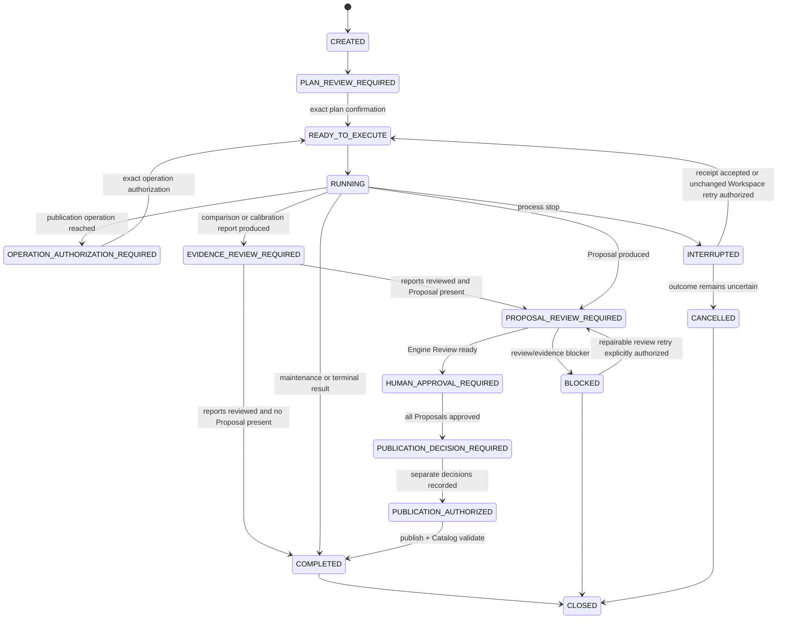

# Agent Operation Session Protocol

`AgentOperationSession` is the external Workspace system of record for an Agent-native operation. It replaces reliance on one Agent conversation and does not replace canonical Harness assets or Engine lifecycle files.

An unknown Source starts with `SourceDescriptor/v1` and a generic `AgentOperationSession` whose first finite operation is `ANALYZE_TAXONOMY`. An append-only `ClassificationSession/v1` projection retains its immutable attempts: exact descriptor and resolved Source binding, static Source snapshot, user-owned Resolved Taxonomy snapshot, taxonomy-blind Source concept hypothesis, retrieval and Advisor receipts, deterministic axis results, presentation, and current digest. Only `TAXONOMY_MATCHED` plus a separate exact human continue decision attaches `ClassificationHandoff/v1` to that same `AgentOperationSession`. The handoff proves neither Harness Eligibility nor Proposal authority; it preserves the descriptor, ordered membership or Git commit, snapshot and classification context for the independent retained lifecycle. Harness planning reuses that exact resolved Source without implicit GitHub refetch; any drift or substitution requires re-analysis.

The v4.4 candidate uses Agent Operations Protocol v3. Every governed stage contains an exact Engine-owned `BusinessDecisionView`, a complete `ComplianceAuditEnvelope`, a `SourceToHarnessReasoningMap`, and a finite `DecisionDefinition`. Professional stages also bind `HarnessProfessionalAnalysis`, `HarnessArchitectureAssessment`, `SourceOutcomeExplanation`, and `EvolutionContextBinding`. The Host renders the Business View as the primary conversation and may collapse—but not omit—the Audit Envelope. When an MCP result carries the Harness exact-presentation metadata, its primary text is already the canonical Business View and must replace the whole assistant turn byte-for-byte; Host prefixes, suffixes, emoji, summaries, translations, transitions, and next-step prose are forbidden. The Operation Server creates the non-authoritative `CanonicalPresentationDeliveryReceipt` in that same response path, before returning the view; no second user prompt or assistant turn is allowed. The receipt is never a human approval and screen-level conformance remains independently testable at the Host boundary.

## Presentation Sandbox

The presentation sandbox is an Engine-owned schema and rendering boundary. It is not a Host prompt and does not rely on the Host model following instructions. The Engine validates structured professional reasoning, selects a finite Source outcome, applies one versioned fixed template, and emits the only allowed canonical business prose. The bound locale is part of the Evolution Context. Raw protocol objects, paths, digests, receipts, and model logs remain in the Audit Envelope instead of leaking into the primary user view.

A same-context replay reads the immutable professional objects and archived Frames. It does not rerun Source ingestion, matching, Advisor calls, approval, publication, close, or cleanup. A Source, Catalog, Ontology, policy, Advisor profile, intent, locale, or template-version change requires explicit reevaluation and a new context digest; silent reuse is forbidden.

## Storage

```text
EVOPILOT_HARNESS_HOME/
  agent-operation-receipts/
    <idempotencyKey>.json
  agent-sessions/
    <sessionId>/
      .ownership.json
      session.json
      journal.jsonl
  classification-sessions/
    <classificationSessionId>/
      session.json
```

`session.json` and Engine operation receipts are written atomically with mode `0600`. New Sessions bind the exact Product version, Expert version, Core digest, Agent protocol, and Engine API accepted during MCP initialization. `sessionDigest` covers all fields except itself. Every mutation requires the last observed digest. `interaction.frameArchive` retains every immutable Protocol v3 Frame when it becomes current; this permits presentation replay without repeating governed mutations. `journal.jsonl` records sequence, event, actor, resulting Session digest, and bounded operation/result references. A stable idempotency key binds each planned operation to its Session, Plan, index, operation, and input digest.

Complete-lifecycle production acceptance runs three distinct fresh Workspace, Session, and WorkBuddy tasks from zero to one with identical governed inputs. It compares Engine-owned Frames by normalized structure, business semantics, finite choices, locale, and lifecycle order. Run-specific identities may differ, and isolated Host chrome, loading, model-status, and transport-status surfaces are excluded. A single Frame repeated three times or one completed Session replayed three times is not complete-lifecycle evidence.

For a completed lifecycle whose historical Session predates `frameArchive`, the read-only `inspect_lifecycle_presentation_archive` tool reconstructs the same five-stage presentation from integrity-checked Plan, Proposal, approval, publication, and Catalog bindings. The result reports `governedMutationCount: 0`; it neither advances state nor grants authority.

Only normalized source references are persisted. Unknown source fields and raw secret material fail before Plan persistence. The Workspace root and internal Session/receipt/output paths must remain under the external Workspace and may not escape through symlinks.

## State Model



## Integrity Bindings

- Intent binds normalized human text by `intent.digest`.
- Compatibility binds Product, Digital Expert Core, Agent protocol, and Engine API before the first mutation and again on cross-Agent resume.
- Plan binds scenario, sources, operations, stop points, and authority by `planDigest`.
- A maintenance publication authorization binds Plan digest, operation index, operation digest, and human identity value.
- A planned Engine operation receipt binds its stable idempotency key, operation, input digest, full structured result, and receipt digest.
- An evidence report reference binds report type, id, digest, rendered deterministic fields, review status, reviewer value, and review time. Acknowledgement revalidates the persisted report before changing Session state.
- Proposal approval binds Engine `reviewInputDigest`, Review `reportDigest`, Evaluation review, confirmation, and reviewer value.
- Publication authorization binds the full approved Proposal digest after approval.
- A repairable blocked Proposal Review retry binds the failed Review result digest, unchanged external Workspace digest, complete blocker and retry-frame presentation receipts, and a separate human decision. It grants retry only; it grants no Proposal approval or publication authority.
- Publication rechecks the authorization and current Proposal before writing.
- Every governed decision additionally binds the current Session, subject, frame, Business View, Audit Envelope, Decision Definition, Host delivery, and receipt through one composite digest. Any changed component invalidates the decision.
- Every Protocol v3 Plan binds its `EvolutionContextBinding`. Source and governed-environment drift returns the Session to explicit reevaluation instead of silently changing analysis or presentation.

Natural-language continuation is never a gate token. The Digital Expert asks one plain-language decision about the immutable object currently presented, then constructs and submits the exact token internally. It never asks a human to transcribe protocol values or reuses a decision for a later digest.

Comparison and calibration Sessions stop at `EVIDENCE_REVIEW_REQUIRED`. `ACKNOWLEDGE_COMPARISON_REVIEW:<reportId>:<reportDigest>` and `ACKNOWLEDGE_CALIBRATION_REVIEW:<reportId>:<reportDigest>` confirm only that the exact report was reviewed. They cannot substitute for Proposal approval, policy activation, rollback authorization, or publication authorization.

## Recovery

The Operation Server inspects existing Sessions at startup only after a compatible MCP client completes initialization. Recovery revalidates each persisted Session's Product version, Expert version, Core digest, Agent protocol, and Engine API. An incompatible Session is returned as `INCOMPATIBLE_PRESERVED` and remains byte-for-byte unchanged. A stopped Protocol v3 Session may use `migrate_operation_session_core_compatibility` only when Product version, Expert version, Agent protocol, and Engine API are unchanged and the exact prior Core digest is supplied. The migration records both bindings and changes neither business state nor authority. A compatible persisted `RUNNING` Session becomes `INTERRUPTED`. It returns `nextAction=reconcile-interrupted-operation` when an Engine mutation has an unknown outcome, or `nextAction=request-explicit-plan-resume-confirmation` when no operation is in flight and the remaining confirmed Plan can resume safely. A different compatible Agent resumes with the current digest and a new Adapter id.

Recovery is fail-closed:

1. If the Engine wrote a valid operation receipt, the human may accept that exact receipt and continue without executing the operation again.
2. If no receipt exists and the Engine Workspace digest is unchanged, the human may explicitly authorize retry of the same stable idempotency key.
3. If the Workspace changed without a receipt, the operation outcome is uncertain. Retry is forbidden; cancel or preserve the Session and inspect the retained Engine artifacts.

When no unknown in-flight operation exists, the human may resume the remaining confirmed Plan with the exact `RETRY_INTERRUPTED_PLAN:<sessionId>:<planDigest>` token. This plan-level token never reconciles or authorizes repetition of an uncertain Engine mutation.

An Agent may not convert process restart, “continue”, or a previous chat statement into retry authority.

## Fresh v4.5 representation baseline

v4.5 starts only from a fresh v4.5 Workspace and Session representation. Pre-v4.5 Sessions are preserved byte-for-byte but return `PRE_V45_SESSION_UNSUPPORTED`; the Engine neither reads their lifecycle state nor offers a migration tool. This reset applies to data and protocol representation only. The current v4.5 lifecycle still includes every retained v4.4 product capability from Source evidence through safe close.

A `BLOCKED` Proposal Review with `nextAction=repair-reviewer-and-rerun` uses a distinct fail-closed path. The Agent must first complete `BLOCKER_PRESENTATION`, repair the declared reviewer dependency, prepare and completely display `BLOCKED_RETRY_PRESENTATION`, and obtain a new digest-bound decision through `authorize_blocked_operation_retry`. Only then does the Session return to `PROPOSAL_REVIEW_REQUIRED`; `review_session_proposals` remains a separate call. Semantic `REVISE` outcomes are not eligible for this technical retry path.

## Long-running Proposal Review

An `OperationJob` is transport durability, not another lifecycle gate. It owns a stable identity for one exact `proposal.review` request and delegates to the same Session Review implementation used by the synchronous tool. WorkBuddy always uses this route; another Host uses it when its verified synchronous MCP window is insufficient or unknown. `RUNNING`, `SUCCEEDED`, `FAILED`, and recovery status never imply Proposal approval or any later authority. A duplicate start, client timeout, disconnect, or Host replacement must inspect the same Job. The detached worker survives ordinary MCP-client loss. A missing worker with no durable result becomes `INTERRUPTED_UNCERTAIN`; it is never restarted automatically. A completed Job returns a compact Engine-owned result view containing the canonical Business Decision View and binding digests; the complete Audit Envelope remains available through the Session resource. Hosts must not parse the private Job file or synthesize a replacement presentation.

## Third-party Host boundary

The Host owns conversation UI, attachment and Workspace selection, Digital Expert and MCP loading, exact canonical rendering, non-authoritative progress transport, and explicit user-choice transport. The Operation Server owns local stdio transport, capability negotiation, Session coordination, receipts, `OperationJob`, and recovery. The Engine alone owns evidence ingestion, professional reasoning, eligibility, matching, scoring, architecture assessment, Source outcome, presentation templates, lifecycle state, gates, Proposal, Evaluation, Review, publication, and Catalog mutation.

Before lifecycle entry the Host must provide a conformant profile for all required capabilities. A weak or hostile Host cannot compensate with prompt text: missing exact-render, locale, receipt, operation interception, recovery, timeout, or Host-prose-suppression capability fails closed. Pixel layout and non-governed transport metadata may differ by Host; canonical business bytes, semantic objects, locale, stage order, choices, and digests may not.

## Cleanup

Closing preserves Session, Engine runs, Proposals, Catalogs, and assets. Cleanup is optional and only deletes a closed Session directory when `.ownership.json`, Session id, current digest, human identity value, and exact cleanup token all match. It never deletes evolution runs or published assets.
