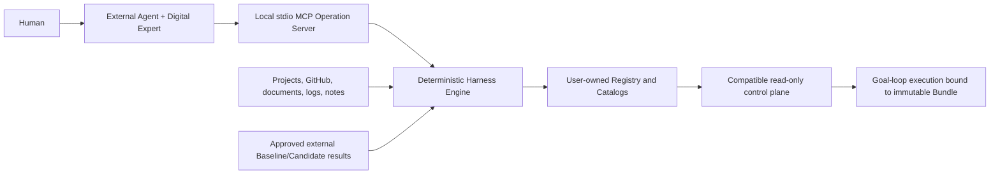
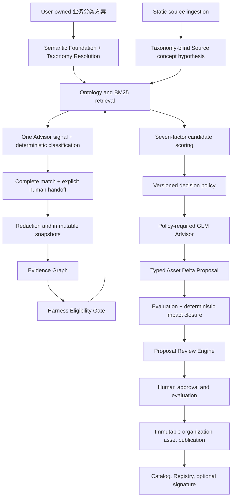

# Architecture Overview

`evopilot-harness` is an independent Harness production system. It converts explicitly supplied engineering evidence into reviewed, versioned, immutable Harness assets and publishes those assets through user-owned Catalogs.

## System Boundary



`evopilot-harness` owns production and publication. EvoPilot owns project onboarding, project-level matching, goal-loop execution, project evidence, and release decisions. Dashboard may embed Harness Hub but owns no Harness state.

## Production Pipeline



The deterministic boundary decides eligibility and asset relationship. GLM receives a Policy-budgeted projection of redacted evidence plus the deterministic result; the complete Evidence Graph remains the audit source of record. GLM may recommend changes but cannot approve, publish, execute commands, or override gates.

## Modules

| Layer | Modules | Boundary |
|---|---|---|
| Runtime | Engine, Workspace, CLI, Harness Hub | Engine code is read-only; mutable state belongs in the Workspace. |
| Agent Operation | Digital Expert Core, generated Agent Adapters, local Harness Operation Server, AgentOperationSession, External Agent Host | Conversation and transport cannot create Engine verdicts, identity, approval, publication authority, or source execution. |
| Evidence | Source Ingestion, Snapshot/Redaction, Evidence Graph | `SourceDescriptor/v1` normalizes local, GitHub and ordered-set inputs. GitHub is bounded read-only Git acquisition into the external Workspace; inputs remain evidence only, are never executed, and never gain publication authority. |
| Classification | Semantic Foundation/Taxonomy Resolution, taxonomy-blind Source hypothesis, multi-signal retrieval, one-call Advisor evidence, deterministic decision aggregate, explicit handoff | User schemes provide vocabulary only. The Engine owns validation and the final result; classification never proves Harness Eligibility. |
| Reasoning | MatchPolicyPack, Eligibility Gate, Retrieval/Scoring, Decision Aggregator, Asset Delta Analyzer | Thresholds, exact before/after state, and deterministic impact rules are versioned and auditable, not hidden model decisions. |
| Advisor | AdvisorPolicyPack, GLM Advisor, Proposal Review Engine | Evidence projection, independent Proposal assessment, bounded contract repair, citations, attempts, verdicts, and token metadata are Policy-governed and auditable. |
| Feedback Evidence | Package validator, immutable-binding resolver, content-addressed store, effectiveness aggregator | Reads approved execution outcomes; never executes projects or mutates assets. |
| Comparative Evidence | Immutable package intake, exact-context comparability, paired scoring, versioned rescoring, matching and Proposal calibration | Produces bounded recommendations; never executes assets, mutates active policy, approves, publishes, or rolls back. |
| Assets | HarnessComponent, HarnessProfile, HarnessBundle/Export | Bundle is the immutable execution publication unit. |
| Governance | EvaluationPack, AssetDeltaProposal, Proposal Lifecycle, Schema Validator | Positive/negative evaluation and Delta closure precede a current ready Review Report, human approval, and immutable publication. |
| Distribution | Catalog Publisher/Signing, Registry | Catalog lists assets; Registry lists Catalog roots. |
| Compatibility | Migration/Rollback | v2 inputs migrate into v3 without redefining the canonical asset. |

ADR 0001 defines 24 core Engine modules. [ADR 0005](adr/0005-source-first-business-classification.md) replaces module 8 OntologyPack with Semantic Foundation/Taxonomy Resolution without changing the module count. [ADR 0003](adr/0003-controlled-comparative-evidence.md) adds four controlled comparative-evidence modules, producing 28 enforced Engine module boundaries. [ADR 0002](adr/0002-agent-native-harness-operations.md) adds five operating boundaries, for 33 accepted product and operating boundaries. [ADR 0004](adr/0004-deterministic-business-centric-interaction.md) refines their interaction contract without adding or moving product ownership.

## Workspace Boundary

`workspace init` creates the mutable user home:

```text
EVOPILOT_HARNESS_HOME/
  config.yaml
  harness-registry.yaml
  catalogs/
    builtin/
    organization/
  ontology/
  policies/
    matcher/
    advisor/
    comparison/
  evidence/
  evaluations/
  comparisons/
    packages/
    rejected/
    reports/
    rescores/
    calibration/
  source-cache/
    github/
      remotes/
      refs/
      snapshots/
  evolution-runs/
  cache/github/
  migrations/
  keys/
  classification-sessions/
  agent-sessions/
```

Built-in assets are copied from the Engine into the Workspace's Built-in Catalog during initialization. Evidence-driven production writes only to review run state and, after approval, the Organization Catalog. It must never overwrite Engine assets or the Built-in Catalog.

Each evolution run persists the Evidence Graph, deterministic reasoning, Advisor Run, Proposal, `evaluation-pack.yaml`, `asset-delta-proposal.yaml`, and independent Review Report under the Workspace. v4 additionally persists digest-validated Session state and an append-only operation journal under `agent-sessions/`. v4.1 stores accepted/rejected comparison packages, immutable reports, rescore records, reviewed calibration case sets, and calibration reports under `comparisons/`. The Engine checkout stays read-only.

## Asset And Publication Boundary

- `HarnessComponent` defines one reusable execution capability.
- `HarnessProfile` binds a domain, role, task class, boundary, Components, evidence, and validators.
- `HarnessBundle` resolves Profile and Component versions and SHA-256 digests into an immutable executable publication.
- A Catalog indexes concrete published assets and their digests.
- A Registry discovers one or more Catalog roots and never duplicates asset entries.
- Signing is optional under the current contract; schema, digest, approval, and immutability checks are not optional.

Matching can expose Profile metadata. Execution must bind a published Bundle so later asset evolution cannot change historical execution evidence.

## Independent Version Axes

| Axis | Changes when |
|---|---|
| Engine | CLI, schemas, algorithms, Hub, or runtime code changes. |
| Harness Asset | A Component, Profile, or Bundle evolves. |
| Ontology | Concepts, conflicts, roles, or task relationships change. |
| Policy | Eligibility, weights, thresholds, risks, Advisor projection, repair, or output-contract changes. |
| Evaluation | Reviewed cases or acceptance expectations change. |
| Comparison Policy | Exact-context requirements, sample thresholds, uncertainty, safety gates, or calibration limits change. |
| Catalog | Published membership or metadata changes. |

An asset publication does not require an Engine, EvoPilot, or Dashboard release.

## Compatibility

The canonical asset API namespace remains `harness.evopilot.io/v3`; structured feedback uses `feedback.evopilot.io/v1`, controlled comparison uses `comparison.evopilot.io/v1`, classification uses the v4.5 `Taxonomy/v1` and `ClassificationSession/v1` contracts, and Agent operations use `evopilot-harness-agent-operations/v3`. Optional control-plane projections are exports, not source assets. The published Engine remains `4.4.0` until separate release authorization. v4.5 intentionally does not read or migrate pre-v4.5 Workspace, Session, configuration, package, or protocol representations. This representation reset does not remove product capability: after explicit classification handoff, the complete v4.4 Harness Eligibility, professional reasoning, Catalog comparison, Proposal, Review, approval, separate publication, validation, recovery, and close lifecycle remains required. See [ADR 0002](adr/0002-agent-native-harness-operations.md), [ADR 0003](adr/0003-controlled-comparative-evidence.md), [ADR 0004](adr/0004-deterministic-business-centric-interaction.md), and [ADR 0005](adr/0005-source-first-business-classification.md).
