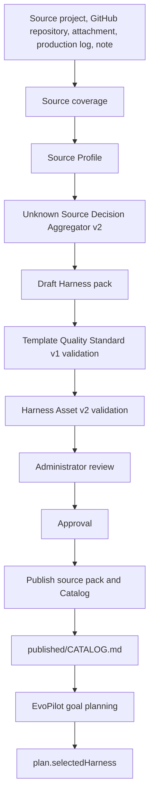

# Architecture Overview

`evopilot-harness` is the Harness authoring and publication system. It is intentionally separate from EvoPilot runtime execution.

## Components

| Component | Responsibility |
|---|---|
| Source packs | Human-reviewed Harness templates under `harnesses/<id>/`. |
| CLI | Catalog publication, local/GitHub source scanning, Unknown Source Decision Aggregator v2, draft generation, Harness Asset v2 validation, strict template validation, review gates, approval, and publication. |
| Evolution store | Local run state under `.evopilot-harness/evolutions/<id>/`. |
| Published Catalog | `published/CATALOG.md` plus versioned Harness directories. This is the artifact EvoPilot reads. |
| Harness Hub | Standalone browser UI served from `ui/harness-hub/` and `/api/hub/snapshot`. |
| EvoPilot | Read-only Catalog consumer that binds `selectedHarness` during goal planning. |
| Dashboard | Optional iframe container for Harness Hub. It does not manage Harness state. |

## Flow

## Design Rules

- Harness lifecycle belongs in `evopilot-harness`.
- EvoPilot reads published Catalog directories and does not mutate them.
- Dashboard can display Catalog and Hub state, but it does not publish Harnesses.
- Published templates are versioned and digest-recorded.
- Existing EvoPilot plans are immutable evidence. New plans can bind newer Harness versions.

## Storage Boundaries

| Path | Owner | Mutability |
|---|---|---|
| `harnesses/` | Harness maintainers | Edited by administrators or evolution publication. |
| `.evopilot-harness/` | Local evolution workflow | Generated runtime state, ignored by Git. |
| `.evopilot-harness/github-sources/` | GitHub repository source cache | Generated clone/fetch cache, ignored by Git. |
| `published/` | Catalog publisher | Generated but tracked as the usable offline Catalog. |
| `ui/harness-hub/` | Harness Hub | Static UI and optional generated snapshot. |
| `dist/release/` | Release workflow | Generated release artifacts, not source truth. |
