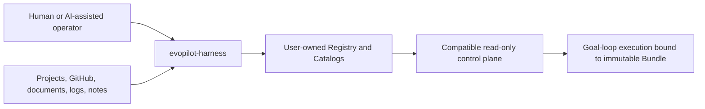
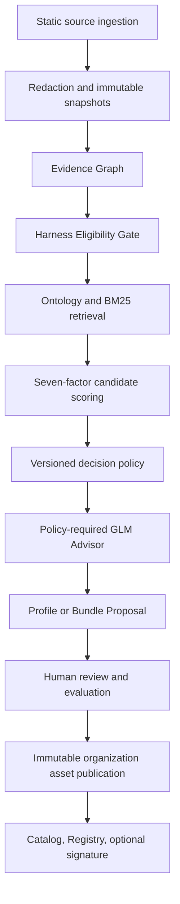

# Architecture Overview

`evopilot-harness` is an independent Harness production system. It converts explicitly supplied engineering evidence into reviewed, versioned, immutable Harness assets and publishes those assets through user-owned Catalogs.

## System Boundary



`evopilot-harness` owns production and publication. EvoPilot owns project onboarding, project-level matching, goal-loop execution, project evidence, and release decisions. Dashboard may embed Harness Hub but owns no Harness state.

## Production Pipeline



The deterministic boundary decides eligibility and asset relationship. GLM receives redacted evidence and the deterministic result; it may recommend changes but cannot approve, publish, execute commands, or override gates.

## Modules

| Layer | Modules | Boundary |
|---|---|---|
| Runtime | Engine, Workspace, CLI, Harness Hub | Engine code is read-only; mutable state belongs in the Workspace. |
| Evidence | Source Ingestion, Snapshot/Redaction, Evidence Graph | Inputs are evidence only and never publication authority. |
| Reasoning | OntologyPack, MatchPolicyPack, Eligibility Gate, Retrieval/Scoring, Decision Aggregator | Domain concepts and thresholds are versioned data, not hidden model decisions. |
| Advisor | AdvisorPolicyPack, GLM Advisor | Evidence-bound advisory output with citations and token metadata. |
| Assets | HarnessComponent, HarnessProfile, HarnessBundle/Export | Bundle is the immutable execution publication unit. |
| Governance | EvaluationPack, Proposal Lifecycle, Schema Validator | Review and validation remain mandatory before publication. |
| Distribution | Catalog Publisher/Signing, Registry | Catalog lists assets; Registry lists Catalog roots. |
| Compatibility | Migration/Rollback | v2 inputs migrate into v3 without redefining the canonical asset. |

The complete 23-module ownership contract is [ADR 0001](adr/0001-product-and-module-boundaries.md).

## Workspace Boundary

`workspace init` creates the mutable user home:

```text
EVOPILOT_HARNESS_HOME/
  config.yaml
  harness-registry.yaml
  catalogs/
    builtin/
    organization/
  ontology/
  policies/
    matcher/
    advisor/
  evidence/
  evaluations/
  evolution-runs/
  cache/github/
  migrations/
  keys/
```

Built-in assets are copied from the Engine into the Workspace's Built-in Catalog during initialization. Evidence-driven production writes only to review run state and, after approval, the Organization Catalog. It must never overwrite Engine assets or the Built-in Catalog.

## Asset And Publication Boundary

- `HarnessComponent` defines one reusable execution capability.
- `HarnessProfile` binds a domain, role, task class, boundary, Components, evidence, and validators.
- `HarnessBundle` resolves Profile and Component versions and SHA-256 digests into an immutable executable publication.
- A Catalog indexes concrete published assets and their digests.
- A Registry discovers one or more Catalog roots and never duplicates asset entries.
- Signing is optional under the current contract; schema, digest, approval, and immutability checks are not optional.

Matching can expose Profile metadata. Execution must bind a published Bundle so later asset evolution cannot change historical execution evidence.

## Independent Version Axes

| Axis | Changes when |
|---|---|
| Engine | CLI, schemas, algorithms, Hub, or runtime code changes. |
| Harness Asset | A Component, Profile, or Bundle evolves. |
| Ontology | Concepts, conflicts, roles, or task relationships change. |
| Policy | Eligibility, weights, thresholds, risks, or Advisor contract changes. |
| Evaluation | Reviewed cases or acceptance expectations change. |
| Catalog | Published membership or metadata changes. |

An asset publication does not require an Engine, EvoPilot, or Dashboard release.

## Compatibility

The canonical v3 API namespace is `harness.evopilot.io/v3`. Optional control-plane projections are exports, not source assets. Engine `3.0.2` retains the v2 CLI and Catalog layer for existing automation; see [v2 Architecture Compatibility](v2-compatibility.md).
