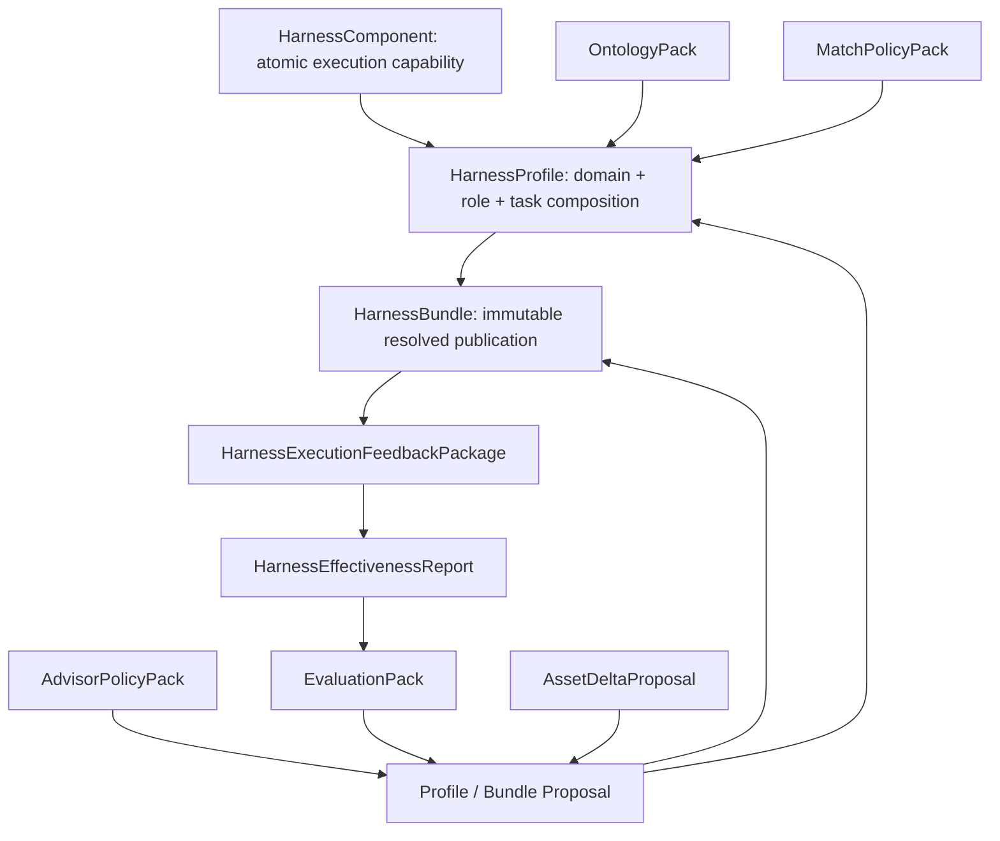

# v3 Asset Model

## Hierarchy



## HarnessComponent

A Component is the smallest reusable execution capability. Its contract includes:

- `environment.workspaceMode`, required tools, and required services;
- actions with executor, inputs, outputs, timeout, and network policy;
- explicit constraints;
- required evidence artifacts;
- blocking and non-blocking validators.

Components are not domain descriptions. They are executable capabilities such as constrained engineering validation, protocol compatibility checks, or release evidence collection.

## HarnessProfile

A Profile composes Components for one repeatable task role. Its contract includes:

- `classification.domain`, `role`, and `taskClass`;
- explicit `boundary.inScope` and `boundary.outOfScope`;
- positive concepts, negative concepts, and required evidence kinds;
- immutable Component references;
- required acceptance evidence and blocking validators;
- an Evaluation Pack reference.

An unknown domain first becomes a Profile Proposal. It cannot be silently published by the matcher or the LLM.

## HarnessBundle

A Bundle is the executable publication unit. It includes:

- a pinned Profile id, version, and SHA-256 digest;
- resolved Component versions and SHA-256 digests;
- a stable execution plan;
- aggregate constraints, evidence, and validators;
- optional control-plane exports.

Bundle validation fails when the referenced Profile digest or any referenced Component digest does not match the actual immutable asset.

## Supporting Packs

### OntologyPack

Defines versioned concepts, terms, parents, conflicts, roles, task classes, and evidence kinds. Domain-specific words and role relationships belong here, not in matcher code.

### MatchPolicyPack

Defines eligibility minimums, BM25 parameters, factor weights, decision thresholds, Advisor-required decisions, and human-approval-required decisions.

### AdvisorPolicyPack

Defines the generic evidence-bound system prompt, allowed decisions, required response fields, citation requirement, deterministic LLM-input projection budget, bounded structure/citation repair, and authority limits.

### EvaluationPack

v1 stores reviewed input digests and expected decisions. v2 additionally binds an exact asset and defines Outcome, Process, Safety, and Cost criteria with immutable feedback-package references. v3 defines portable positive and negative cases with context, assertions, pinned validators and scorers, optional baseline references, expected outcomes, and regression boundaries. A generated pack starts as `INSUFFICIENT_EVAL_EVIDENCE`; v1 and v2 remain readable.

### AssetDeltaProposal

The review-stage Delta contract covers `HarnessComponent`, `HarnessProfile`, `HarnessBundle`, `OntologyPack`, `MatchPolicyPack`, `AdvisorPolicyPack`, and `EvaluationPack`. Each Delta records exact before/after documents and digests, evidence-linked paths, operation semantics, compatibility, dependencies, blast radius, expected effect, regression coverage, and rollback.

`EVOLVE_EXISTING`, `COMPOSE_NEW_BUNDLE`, and `PROPOSE_NEW_PROFILE` may advance through review. `NO_CHANGE` and `NEED_MORE_EVIDENCE` retain an auditable Proposal but always set `publicationAllowed=false`.

Closure is derived rather than trusted. The validator schema-checks embedded documents, binds proposed assets and Evaluation state, resolves immutable baselines, and recomputes every change and impact field. Approval binds the current Review Report and approved Proposal content by digest. Publication rebuilds after-states from the exact immutable documents being written, so a published Delta digest is the digest of the published asset rather than its earlier review-stage representation.

## Feedback Evidence Contracts

### HarnessExecutionFeedbackPackage

Carries approved, redacted, time-bounded execution evidence with Package and payload digests, provenance, execution context, four measured dimensions, and exact references to one published immutable Bundle, its Profile, and its complete Component closure.

It is Workspace evidence, not a Catalog asset. Validation resolves every id, version, lifecycle, and digest. Ingestion is content-addressed and idempotent.

### HarnessEffectivenessReport

Aggregates accepted Packages by Bundle, Profile, Component, and version. It includes sample and independent-source counts, context coverage, missing fields, Outcome/Process/Safety/Cost measures, uncertainty level, and Wilson 95% intervals.

The Report cannot mutate or publish an asset and is not a causal or evolution decision.

## Formal Validation

Schemas are under [`schemas/`](../../schemas):

- `harness-asset-v3.schema.json`
- `ontology-pack-v1.schema.json`
- `match-policy-pack-v1.schema.json`
- `advisor-policy-pack-v1.schema.json`
- `evaluation-pack-v1.schema.json`
- `evaluation-pack-v2.schema.json`
- `evaluation-pack-v3.schema.json`
- `asset-delta-proposal-v1.schema.json`
- `harness-execution-feedback-package-v1.schema.json`
- `harness-effectiveness-report-v1.schema.json`

Only Component, Profile, and Bundle assets enter normal consumer Catalog discovery. Published Evaluation and Delta records provide lifecycle provenance but are not execution assets. Feedback Packages and Reports remain under the external Workspace `feedback/` tree.

Use:

```bash
node src/index.mjs asset v3-validate --workspace "$EVOPILOT_HARNESS_HOME" --json
node src/index.mjs asset v3-test --workspace "$EVOPILOT_HARNESS_HOME" --json
```

See [Asset Delta And Evaluation](../guides/asset-delta-and-evaluation.md) for closure semantics and CLI usage.
