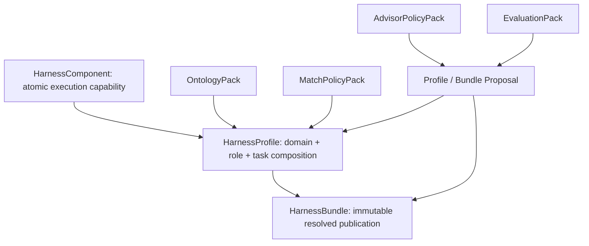

# v3 Asset Model

## Hierarchy



## HarnessComponent

A Component is the smallest reusable execution capability. Its contract includes:

- `environment.workspaceMode`, required tools, and required services;
- actions with executor, inputs, outputs, timeout, and network policy;
- explicit constraints;
- required evidence artifacts;
- blocking and non-blocking validators.

Components are not domain descriptions. They are executable capabilities such as constrained engineering validation, protocol compatibility checks, or release evidence collection.

## HarnessProfile

A Profile composes Components for one repeatable task role. Its contract includes:

- `classification.domain`, `role`, and `taskClass`;
- explicit `boundary.inScope` and `boundary.outOfScope`;
- positive concepts, negative concepts, and required evidence kinds;
- immutable Component references;
- required acceptance evidence and blocking validators;
- an Evaluation Pack reference.

An unknown domain first becomes a Profile Proposal. It cannot be silently published by the matcher or the LLM.

## HarnessBundle

A Bundle is the executable publication unit. It includes:

- a pinned Profile id, version, and SHA-256 digest;
- resolved Component versions and SHA-256 digests;
- a stable execution plan;
- aggregate constraints, evidence, and validators;
- optional control-plane exports.

Bundle validation fails when the referenced Profile digest or any referenced Component digest does not match the actual immutable asset.

## Supporting Packs

### OntologyPack

Defines versioned concepts, terms, parents, conflicts, roles, task classes, and evidence kinds. Domain-specific words and role relationships belong here, not in matcher code.

### MatchPolicyPack

Defines eligibility minimums, BM25 parameters, factor weights, decision thresholds, Advisor-required decisions, and human-approval-required decisions.

### AdvisorPolicyPack

Defines the generic evidence-bound system prompt, allowed decisions, required response fields, citation requirement, deterministic LLM-input projection budget, bounded structure/citation repair, and authority limits.

### EvaluationPack

Stores reviewed input digests and expected decisions. A generated proposal starts as `INSUFFICIENT_EVAL_EVIDENCE`. It becomes `READY` only when its minimum reviewed-case contract is met.

## Formal Validation

Schemas are under [`schemas/`](../../schemas):

- `harness-asset-v3.schema.json`
- `ontology-pack-v1.schema.json`
- `match-policy-pack-v1.schema.json`
- `advisor-policy-pack-v1.schema.json`
- `evaluation-pack-v1.schema.json`

Use:

```bash
node src/index.mjs asset v3-validate --workspace "$EVOPILOT_HARNESS_HOME" --json
node src/index.mjs asset v3-test --workspace "$EVOPILOT_HARNESS_HOME" --json
```
