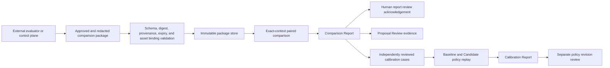

# Controlled Comparative Evidence And Calibration

Engine v4.1.0 turns externally produced Baseline/Candidate observations into immutable, replayable evidence for Harness and policy review. It does not execute either side, decide project releases, approve or publish a Harness, activate a policy, or perform a rollback.

## End-To-End Flow



The comparison is bounded to the exact task, source snapshot, environment, model configuration, toolchain, EvaluationPack, scorer set, metrics, and Baseline/Candidate asset digests. A different context is a different stratum. The Engine never merges incompatible strata into one metric conclusion.

## Contracts

| Contract | Purpose | Authority |
|---|---|---|
| `HarnessComparisonEvidencePackage` | Approved, redacted, time-bounded paired observations plus immutable bindings and provenance. | Evidence only. |
| `ComparisonPolicyPack` | Minimum repetitions, exact binding requirements, missing-data policy, confidence, safety gates, and calibration thresholds. | Deterministic policy; no lifecycle authority. |
| `HarnessComparisonReport` | Comparability, paired metrics, uncertainty, conflicts, safety blockers, limitations, and one recommendation. | May recommend only. |
| `HarnessComparisonRescoreRecord` | Append-only link from a source report/package set to a new scorer and policy result. | Cannot mutate raw observations or prior reports. |
| `HarnessCalibrationCaseSet` | Independently reviewed matching and Proposal cases with exact Evidence Graph or Comparison Report references. | Reviewed evidence; fixtures are not production truth. |
| `HarnessCalibrationReport` | Baseline/Candidate pass rates, ranking, abstention, false upgrade, false new profile, regressions, conflicts, and uncertainty. | Cannot activate policy. |

All contracts use `comparison.evopilot.io/v1` and validate against the versioned schemas in `schemas/`.

## Comparison Decisions

The report emits exactly one recommendation:

| Recommendation | Meaning | Next review action |
|---|---|---|
| `NON_COMPARABLE` | Required contexts or bindings differ. | Repair or separate the evidence contexts. |
| `NEED_MORE_EVIDENCE` | Repetitions, sources, coverage, or uncertainty are insufficient. | Collect more approved paired observations. |
| `CONFLICT` | Equally supported evidence strata or reports disagree. | Resolve the evidence conflict. |
| `KEEP_BASELINE` | Candidate has no supported improvement or regresses. | Keep the current asset and inspect causes. |
| `REVISE_CANDIDATE` | Candidate has a required or safety regression. | Revise the candidate before another comparison. |
| `CANDIDATE_READY_FOR_HUMAN_REVIEW` | Required metrics are non-regressing and the bounded comparison supports the Candidate. | Continue to Proposal Review and separate human approval. |
| `ROLLBACK_RECOMMENDED` | A published Candidate shows a blocking regression. | Start a separate, explicitly reviewed rollback decision. |

No recommendation approves, publishes, activates, rolls back, or executes anything.

## Ordinary Agent Workflow

The ordinary human path is the Digital Expert. Tell a compatible Agent:

```text
Use /absolute/path/to/comparison.yaml as an approved comparison evidence package.
Show me the exact Operation Plan, process it through evopilot-harness,
present the complete Comparison Report, and stop for report review acknowledgement.
```

The Agent uses the local stdio MCP server to:

1. run `comparison.validate` as a read-only diagnostic;
2. create a `comparison` Session Plan bound to the exact file, policy, time, and Workspace;
3. request `CONFIRM_OPERATION_PLAN:<planDigest>`;
4. execute `comparison.process` through the deterministic Engine;
5. enter `EVIDENCE_REVIEW_REQUIRED` and present comparability, metrics, uncertainty, recommendation, reasons, limitations, provenance, authority, and next action;
6. request `ACKNOWLEDGE_COMPARISON_REVIEW:<reportId>:<reportDigest>`;
7. complete or continue to a Proposal Review when the Session contains Proposals.

For calibration, provide an approved case set and explicit Baseline/Candidate policy files. The Agent follows the same Plan gate, runs `calibration.run`, presents ranking, error rates, abstention, regression, conflicts, uncertainty, and recommendation, then requests `ACKNOWLEDGE_CALIBRATION_REVIEW:<reportId>:<reportDigest>`.

Acknowledgement means only that the exact report was reviewed. It is not approval or publication authorization.

## Atomic JSON CLI

Atomic commands remain available for CI, compatibility, and diagnosis:

```bash
evopilot-harness comparison inspect /absolute/path/to/comparison.yaml --json
evopilot-harness comparison validate /absolute/path/to/comparison.yaml \
  --workspace "$EVOPILOT_HARNESS_HOME" --json
evopilot-harness comparison process /absolute/path/to/comparison.yaml \
  --workspace "$EVOPILOT_HARNESS_HOME" --json
evopilot-harness comparison report <report-id> \
  --workspace "$EVOPILOT_HARNESS_HOME" --json
```

Rescoring appends a new report and a replacement record:

```bash
evopilot-harness comparison rescore <report-id> \
  --workspace "$EVOPILOT_HARNESS_HOME" \
  --policy-file /absolute/path/to/comparison-policy.yaml \
  --reason "Apply the reviewed scorer and policy revision." \
  --json
```

Calibration validates and ingests an independently reviewed case set, then replays explicit policy versions:

```bash
evopilot-harness calibration validate /absolute/path/to/case-set.yaml \
  --workspace "$EVOPILOT_HARNESS_HOME" --json
evopilot-harness calibration ingest /absolute/path/to/case-set.yaml \
  --workspace "$EVOPILOT_HARNESS_HOME" --json
evopilot-harness calibration run \
  --workspace "$EVOPILOT_HARNESS_HOME" \
  --case-set-id <case-set-id> \
  --baseline-match-policy /absolute/path/to/baseline-match-policy.yaml \
  --candidate-match-policy /absolute/path/to/candidate-match-policy.yaml \
  --baseline-comparison-policy /absolute/path/to/baseline-comparison-policy.yaml \
  --candidate-comparison-policy /absolute/path/to/candidate-comparison-policy.yaml \
  --json
evopilot-harness calibration report <report-id> \
  --workspace "$EVOPILOT_HARNESS_HOME" --json
```

A case set may contain only matching cases or only Proposal cases. Supply the policy pair required by the included case types. A Proposal case replays only the package digests bound by its reviewed `comparisonReportRef`; evidence accepted later cannot silently change that case. Include later evidence by reviewing and publishing a new case-set version. Automation must parse `status`, `nextAction`, `failures`, `blockers`, `recommendation`, and report digests; it must not parse prose.

## Workspace State

```text
EVOPILOT_HARNESS_HOME/
  policies/comparison/
  comparisons/
    packages/
    rejected/
    reports/
    rescores/
    ingestion-events.jsonl
    calibration/
      case-sets/
      reports/
```

Package ids, report ids, and case-set ids are immutable identities. Exact duplicate ingestion is idempotent. Conflicting content under the same identity is rejected. Rescoring appends a replacement record. Calibration derives its timestamp and identity from immutable inputs, so an identical replay returns the same report bytes; a changed case set or policy binding creates a different report. Neither operation rewrites active assets or policies.

## Proposal Integration

When a current report is bound to a Proposal digest, Proposal Review reports both:

- `expectedEffect`: the effect predicted by the Asset Delta and Evaluation closure;
- `comparisonAssessment`: the effect supported by the governed Baseline/Candidate evidence.

New accepted packages, a replacement report, tamper, an expired package, a changed Proposal digest, or a contradictory report invalidates the prior comparison snapshot. Existing reports for the same Proposal id but an older Proposal digest are `STALE`, not `NOT_PROVIDED`. `proposal approve` and `proposal publish` recompute the snapshot and fail closed until a new Proposal Review is completed.

Legacy Proposals do not require comparative evidence unless a reviewed policy explicitly requires it for their risk class.

## Harness Hub

Harness Hub exposes read-only comparison and calibration summaries: report status, recommendation, uncertainty, blockers, provenance references, limitations, ranking, regressions, and next action. Local Workspace and installed-package paths are projected as `workspace:///...` and `package:///...` references rather than host absolute paths. The Hub does not expose raw sensitive evidence or provide approval, policy activation, rollback, or publication authority.

## Limits

- The Engine does not generate execution observations. An external evaluator or control plane must produce and approve them.
- A passing fixture proves contract behavior, not open-domain matching accuracy or universal Candidate quality.
- Correlation under one bound context is not causal proof.
- LLM semantic advice cannot override comparability, safety, uncertainty, conflict, schema, digest, human-review, or publication gates.
- v4.1.0 does not implement long-horizon asset learning, unrestricted research, model training, Goal Loop execution, or source-project execution.

See [ADR 0003](../architecture/adr/0003-controlled-comparative-evidence.md), [MCP Reference](../agent/mcp-reference.md), [Session Protocol](../agent/session-protocol.md), [CLI Commands](../cli/commands.md), and [v4.1 Acceptance](../operations/v4.1-acceptance.md).
